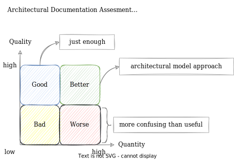
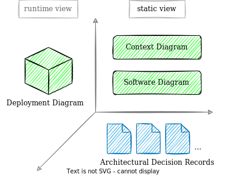
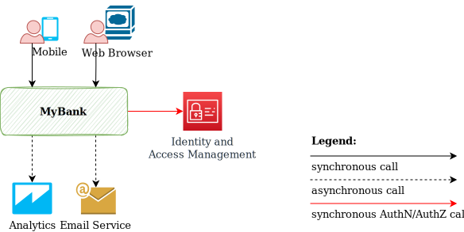

# Just Enough Architectural Documentation

## Content

- [Intro](#intro)
- [Quality vs. Quantity](#quality-vs-quantity)
- [Just Enough](#just-enough)
  - [Context Diagram](#context-diagram)
  - [Software Diagram](#software-diagram)
  - [Deployment Diagram](#deployment-diagram)
  - [Architectural Decision Record](#architectural-decision-record)
- [Is there something else to consider?](#something-else-to-consider)
- [Why not use an architectural model?](#why-not-use-an-architectural-model)
- [Further References](#further-references)

## Intro

For more than one and a half decades, I have been working on different systems with different architectures. During this period I was either contributing or had the official responsibility to create and maintain the architectural documentation. Nevertheless, I always kept on asking myself what is the minimum but also the meaningful amount of architectural documentation. I concluded there is not a single nor the right answer since it always depends on the project but also on company specifics (e.g., stakeholders, size and complexity, domain, internal and external regulations, etc.). Nevertheless, living this experience I saw some common ground that I would like to share with you.

## Quality vs. Quantity

When I reason about architectural documentation I tend to look at it from two different perspectives: **quality** and **quantity**. For me the documentation quality is not negotiable, it always needs to have high standards (i.e., in terms of consistency, accuracy, etc.). On the other side, I see the quantity as very much dependent on the environment and all the specifics I mentioned above (e.g., stakeholders, project, development methodology, company, etc.). There is no direct relation between quality and quantity when talking about architectural documentation.

**Just enough** means, in this context, minimum but meaningful architectural documentation, or architectural documentation with high quality and the appropriate quantity.

An [architectural model](https://en.wikipedia.org/wiki/Software_architectural_model) is a complete and structured way to model the software architecture since it describes the architecture from a different set of concerns and levels of abstractions, etc. A few examples are Kruchten 4+1 view model (1995), Siemens 4 views (Hofmeister et al., 2000), Rozanski and Woods viewpoint set (2005), and Simon Brown C4 model (create between 2006-2011), etc.

To assess the architectural documentation **quality** we have to answer the below questions:

- is documentation (i.e., the diagrams) regularly updated and in sync with the code?
- is every diagram self-descriptive? Does it offer the appropriate level and amount of information?
- is the documentation consistent in terms of look and feel, notations used, structure, etc.?
- is there any contradicting information from different sources of documentation?
- is there a key/legend for the notations used in the diagrams?

To assess the architectural documentation **quantity** we have to answer the below questions:

- is the documentation useful to stakeholders?
- is there any missing documentation?
- is there too much documentation?
- is the documentation too fragmented?
- is the documentation redundant?

For example, one project could have a lot of outdated, redundant, or fragmented documentation (i.e., low quality, high quantity), and another one just the right (not necessarily extensive) documentation that is regularly updated and used by the stakeholders (i.e., high quality with the appropriate quantity). Having low quality and high quantity of documentation is probably the worst scenario you should try to avoid.

## Just Enough

Below is my suggestion in regards to **just enough** architectural documentation that makes sense for the majority of projects where documentation is a concern:

**Note:** **static view** describes the application structures, the elements (or components), and the relations between them without details about their dynamic behavior, that are captured in the **runtime view**.

### **Context Diagram**

A **Context Diagram** (sometimes called an **Application Diagram**) is a high level, abstract illustration of the system boundary, containing the following elements’ types:

1. our system treated as a black box
2. the external entities our system interacts with
3. the connections between our system and other external entities (e.g., third party systems)

This diagram does not reveal any internal detail about our system (and its modularity) and is the most abstract (or high-level) diagram. It has lower volatility (i.e., it does not change so often) hence creating and maintaining it does not take a significant amount of effort.

The main beneficiaries of this diagram are, in general, the business stakeholders (e.g., delivery manager, product owner, business analysts, sponsors, etc.), enterprise architect, solution architect, or people that does not like to go deeper into any technical details but want to understand the surroundings.

**Case study:** let’s suppose we design a system called MyBank. The context diagram looks like this:

### ****Software Diagram****

A ****Software Diagram****(or a ****Software Architecture Diagram****) describes the modularity of our system and the relationships between the internal modules. If the Context Diagram treats the system as a black box, the Software Diagram reveals its internals, it goes one level down in detail.

The main beneficiaries of this diagram are, in general, people with a technical taste (e.g., solution architect, software architect, technical leader, developers, etc.) that are either directly involved in the development process (i.e., constantly writing code) or contribute to the architectural design.

**Case study:** MyBank software diagram (using a microservices approach):

### **Deployment Diagram**

A **Deployment Diagram** maps the software components to the physical infrastructure where the application runs. It must contain all the components from the previous Software Diagram, and, in addition, any other runtime or infrastructure-related assets (e.g., Content Delivery Network, API Gateway, Load Balancer, etc.).

The main beneficiaries of this diagram are DevOps, system engineers, security engineers, etc.

**Case study:** MyBank deployment diagram:

**Note:** the deployment diagram might look a bit cumbersome. It is usually created with the help of DevOps.

### **Architectural Decision Record**

An **Architectural Decision Record** is a relatively short document containing five parts: title, context, decision, status, and consequences. This document is used to capture the important technical decisions made for the project, historized in time, and has the answers to WHY questions (e.g., why is this library used? why is used a microservices approach and not just a monolith? why the integration with the third-party system is using HTTP synchronous calls? why there is a direct DB connection and not using an [ORM](https://en.wikipedia.org/wiki/Object%E2%80%93relational_mapping)?). The overall idea was initially described by Michael Nygard in his article [Documenting Architecture Decisions](https://cognitect.com/blog/2011/11/15/documenting-architecture-decisions) and today become a standard already.

## Is there something else to consider?

These three types of diagrams (e.g., context diagram, software diagram, and deployment diagram) together with the architectural decision records gives already a very good understanding of the architecture. Based on my experience this is already enough and provides a very solid basis.

Nevertheless, depending on the project complexity and your particular role (need or taste), you might choose to create other types of diagrams. For example, a solution architect, a software architect, or a developer could create additional sequence diagrams or any other documentation with an architectural impact (e.g., reference architecture diagram). A business analyst could create use case diagrams, state diagrams, etc.

## Why not use an architectural model?

It is important to understand the rationale behind an architectural model, but in practice, I would advise you to apply only the parts that make sense for your project. There is nothing wrong to use an architectural model, but this comes with additional complexity that you have to assess and decide if it pays off. I am a fan of creating just enough documentation rather than implementing a full architectural model. If this is too less, no problem, there are options on how to enhance the documentation if there is an extra need. Otherwise, just keep it simple but not simplistic (i.e., high quality with the appropriate quantity).

## Further References

Complementary to this post I highly recommend reading these two complementary articles:

- [Why Do We Need Architectural Diagrams?](https://ionutbalosin.com/2019/02/why-do-we-need-architectural-diagrams)
- [The Art Of Crafting Architectural Diagrams](https://ionutbalosin.com/2017/09/the-art-of-crafting-architectural-diagrams)
