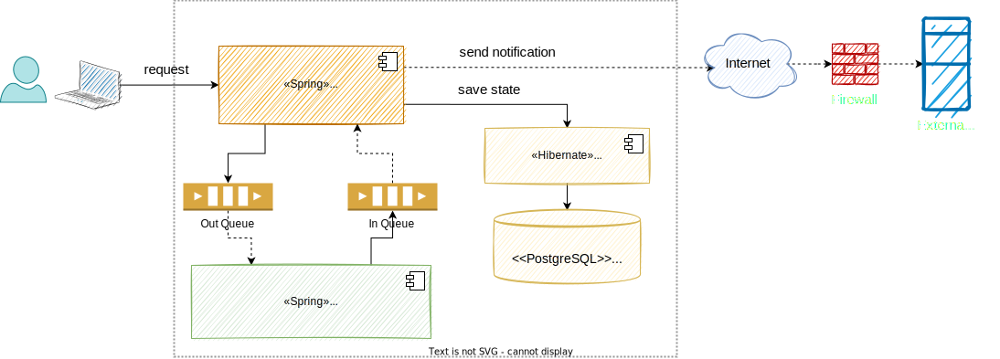

# The Art of Crafting Architectural Diagrams

## Content

- [Key Takeaways](#key-takeaways)
- [Current pitfalls when designing architectural diagrams](#current-pitfalls-when-designing-architectural-diagrams)
- [Guidelines to follow when creating architectural diagrams](#guidelines-to-follow-when-creating-architectural-diagrams)
- [Does the Architectural Description Language (e.g. UML, ArchiMate, etc.) make a difference?](#does-the-architectural-description-language-eg-uml-archimate-etc-make-a-difference)
- [How can diagrams be kept up-to-date as the system is developed, and changes to the architecture materialize](#how-can-diagrams-be-kept-up-to-date-as-the-system-is-developed-and-changes-to-the-architecture-materialize)
- [What complications (or simplifications) emerge for architectural diagrams when dealing with modern architectures (e.g. microservices)?](#what-complications-or-simplifications-emerge-for-architectural-diagrams-when-dealing-with-modern-architectures-eg-microservices)

*According to the licensing policy, I would like to mention this article was originally published on [InfoQ](https://www.infoq.com/articles/crafting-architectural-diagrams).*

## Key Takeaways

- Designing architectural diagrams might not be an easy task; it can be tricky or error prone, even for the simplest ones. Creating consistent and meaningful diagrams brings clarity and consensus across different stakeholders.
- In most cases, the real issues are not strictly related to using a less efficient Architectural Description Language (e.g. UML), but the misunderstanding of diagrams importance, relying on improper or inconsistent guidelines or even the lack of architectural education.
- In the process of creating diagrams, try to blend automatically generated with manually created ones in order to minimize the work, to illustrate different set of concerns and to cover multiple abstraction levels of the system.
- As the system is evolving, maintaining diagrams up-to-date requires extra effort. We need to know how to efficiently proceed in such cases by still keeping consistency and robustness across architectural diagrams.
- Modern architectures bring extra complexities which are reflected in the diagrams. Additional concerns might emerge and could easily

At some point in time, in every software project we are involved in, there might be a need to create architectural diagrams. Whether we are following a formal architectural model (e.g. Kruchten 4+1, Rozanski & Woods, etc) or not, there is a need to document some parts of the application by creating diagrams. In software architecture, such diagrams are created in compliance with views which are related to a specific viewpoint that could be part of a model, but in the current article I prefer to stick to the term architectural diagram and not be very formal; all the other aspects are not intended to be covered here.

Based on my experience as a software architect and technical trainer, there are a lot of discrepancies between projects and inside the project team from developer to developer in the way architectural diagrams are created. I saw a lot of issues regarding inconsistency, fragmentation, and granularity of the rendered information and the look of the diagrams. In comparison to an architectural model which must be formal and standardized, the diagrams might not necessarily be formalized or follow a specific standard.

Nevertheless, diagrams must be self descriptive, consistent, accurate enough and connected to the code. That’s why it is important that every architect or software engineer rely on several guidelines when creating architectural diagrams, since they are the common ground of communicating the application’s architecture over time (e.g. structure, elements, relationships, properties, principles) and across different stakeholders having various technical backgrounds and concerns.

## Current pitfalls when designing architectural diagrams

Before going deeper into possible issues, I would like to have an analogy to an English idiom which says “a picture is worth a thousand words”. As per this [wiki](https://en.wikipedia.org/wiki/A_picture_is_worth_a_thousand_words) explanation, “it refers to the notion that a complex idea can be conveyed with just a single still image or that an image of a subject conveys its meaning or essence more effectively than a description does”. The same concept applies for an architectural diagram: if it raises more questions than answers, the diagram is not well created. Do not let an architectural diagram require thousand of words or clarifications!

**Example of an improper architectural diagram. It suffers most of the issues described below**

Let’s now iterate through a list of pitfalls which might hinder the process of properly creating  architectural diagrams.

### What does a box or shape denote?

- Using any kind of box or shape which is not properly documented might cause multiple interpretations. It might be associated with either a piece of data, a bunch of code, or a process. Just a simple box in a diagram might raise multiple doubts and it is very important to avoid them by explicitly adding details about the box or shape meaning in the diagram legend.

### What do different edges of a shape represent?

- Each edge of a shape (e.g. dashed, dotted, etc) can be misunderstood in the case of a poor diagram. Does a specific border refer to a specific component type (e.g. a dashed line refers to a container, a microservice, a layer, etc.), or it is just the designer’s preference to have a rich look and feel? Avoid such confusion by providing accurate details in the legend diagram when choosing multiple or non-standard edges.

### What does a line or an arrow denote?

- A line or an arrow can be interpreted either as a data flow (e.g. data flows from system A to system B) or as a relationship across elements (e.g. component A depends on component B). In most cases the relationships or data flows represented by arrows do not converge in the same directions and it is important to explicitly write this in the diagram legend.

### What is the communication/association type indicated by a line or arrow?

- Even if the line refers to a data flow or a relationship across components, the communication type (e.g. in case of data flow) or the association type (e.g. in case of relationship) denoted by that line or arrow must be detailed. For example, if the line represents a data flow, the communication might be synchronous or asynchronous, but if the line refers to a relationship, it might be represented by a dependency, inheritance, implementation, etc. All of these details must be present in the diagram legend.

### What does that color mean?

- Having a ‘perrot’ policolor diagram (e.g. multiple colors for boxes, lines) without any proper documented intention might raise multiple questions (e.g. why are some boxes green and others red? Why are some lines black and others blue?). The color scheme is less important in a diagram, and using a rich number of colors does not bring too much additional content or valuable information. A diagram could also be self explanatory and well designed just by using black and white colors, unless there is a stringent constraint to emphasize some parts of the diagram by using distinguishable colors. In any case, it is always better to stick to the simplicity in terms of colors used, but if it is not the case, do not forget to detail the choice.

### Missing relationships between diagram elements or isolated entities

- Missing relationships between elements or isolated entities in a diagram might be a clue of incompleteness. From both a structural and behavioural perspective, every element or entity should rely on / have a relationship (represented by a line or arrow) with another part of the system represented by a different element.

### Misleading/undocumented acronyms or too vague/generic terms

- When using a label for an element in a diagram, it is recommended to not use any misleading or undocumented acronym which might cause confusions. Just a sequence of letters (e.g. TFH, RBPM) do not mean anything without a proper explanation on the diagram element or, even better, in the diagram legend (e.g. TFH – ticket feed handler, RBPM – rates business process manager).
- Another characteristic of naming diagram elements relates to extremely vague or generic terms (e.g. business logic, integration logic) which do not bring too much valuable information because their names are not properly self-descriptive. This issue might reside at the code level as well, and the suggestion would be to always use self explanatory and suggestive names by following on clean code principles.

### Emphasize technologies, frameworks, programming or scripting languages, IDE or development methodology on diagrams

- Architectural design is not related or fundamentally based on any technology, framework, programming or scripting language, IDE or development methodology. All of these come later on in the process in order to help build the architecture, but they are not the central point. They should not be included in the diagrams, but stated in the architectural description including the rationale around choosing them.

### Mix runtime and static elements in the same diagram

- Runtime elements (e.g. threads, processes, virtual machines, containers, services, firewalls, data repositories, etc.) are not present at compile time and it is recommended to avoid mixing these elements with the static ones (e.g. components, packages, classes) in the same diagram. There are dedicated diagram types (e.g. concurrency diagram, deployment diagram) which are primarily focused on runtime elements and it is important to distinguish between these two elements categories and to avoid mixing them as much as possible.

### Make assumptions like “I will verbally describe this”, and “I will explain it later”

- Everything which is not described by the diagram itself is missing, and there is no room to provide verbal details to complement a diagram. Why? Because all explanations orally mentioned but not captured in the diagram are lost, and later on, when some other stakeholders (e.g. developer, architect) will read the diagram, they will not be aware of these explanations. Try to include all necessary details in a diagram to avoid any need for further clarifications.

### Conflicting levels of details or mixed abstractions

- Adding elements related to different levels of abstraction in the same diagram might conflict, since they are seen from different perspectives. For example, adding components to an architectural context diagram or classes to a deployment diagram might diverge the purpose of the diagram itself. When creating a diagram, try to stick with the same level of abstraction.

### Cluttered or too vague diagrams trying to show too much or insufficient level of detail

- “Everything should be made as simple as possible, but no simpler” is a well known quote belonging to Albert Einstein. This is valid for architectural diagrams as well; the level and the granularity of captured information should be meaningfully elected. This is not an easy thing; it depends on the architectural model used, the experience of the architect and the complexity of the system.

## Guidelines to follow when creating architectural diagrams

Apart the above pitfalls, which must be part of a prerequisite checklist in order to avoid them, there are also general guidelines on how to properly create diagrams:

### Choose the optimal number of diagrams

- As Philippe Kruchten said, “architecture is a complex beast. Using a single blueprint to represent architecture results in an unintelligible semantic mess.” To document modern systems we cannot end up with only one sort of diagram, but when creating architectural diagrams it is not always straightforward what diagrams to choose and how many of them to create. There are multiple factors to take into consideration before making a decision; for example, the nature and the complexity of the architecture, the skills and experience of the software architect, time available, amount of work needed to maintain them, and what makes sense or is useful for meeting stakeholders concerns. For example, a network engineer will probably want to see an explicit network model including hosts, communication ports and protocols; a database administrator is concerned about how the system manipulates, manages and distributes the data, etc. Based on all of these aspects, it is recommended to pick up the optimal number of diagrams, whatever that number is.
- If there are insufficient diagrams (e.g. under-documenting), parts of the architecture might be hidden or undocumented; on the other hand, if there are too many (e.g. over-documenting), the effort needed to keep them consistent, updated and not fragmented might considerably increase.

### Keep structural and semantical consistency across diagrams

- Every diagram should be consistent with the others in terms of boxes, shapes, borders, lines, colors, etc. The structural look and feel should be the same and every stakeholder should have no difficulties in understanding diagrams created by different developers inside a team. Ideally, stick to a common diagramming tool and reuse it across all projects.
- From the semantical point of view, all of these diagrams should be periodically synchronized to latest code changes and between them, since a change in one diagram might impact others. This process might be manually or automatically triggered by using a modeling tool. The latter is the preferred mechanism but this depends from project to project, in all cases the idea is to maintain consistency between diagrams and code, independent of the method or tool. Simon Brown said “diagrams are not useful for architectural improvement if they are not connected to the code”, which emphasizes the idea of semantical consistency.

### Prevent diagrams fragmentation

- Having multiple diagrams might make the architectural description difficult to understand but also a significant effort in maintaining them. As a side effect, fragmentation might appear (e.g. for example two or more diagrams illustrate the same quality attribute – performance, scalability, etc. – but each of them is individually incomplete). In such cases it is recommended to either remove the diagrams which do not reflect relevant quality attributes (linked to architecturally significant requirements) or, even better, to merge diagrams (e.g. concurrency and deployment).

### Keep traceability across diagrams

- To be able to check the history, making comparisons between different diagram versions plus easily reverting to a previous version is also important. Using a modeling tool which does not allow that might be an impediment. The latest trends in the industry rely on using a simple and intuitive plain text language to generate the diagrams out of it, which seems to solve the traceability concern. Another advantage of such an approach is that it implicitly ensures a homogeneous structural consistency between diagrams.

### Add legends next to architectural diagrams

- If you do not follow a standard architectural description language (e.g. UML, ArchiMate), detail every piece of the diagram in the legend (e.g. boxes, shapes, borders, lines, colors, acronyms, etc).
- If this is not the case, in the legend just add the architectural description language as a key and there is no need for additional explanations, since every reader will follow on that language specifics to understand the diagram.

## Does the Architectural Description Language (e.g. UML, ArchiMate, etc.) make a difference?

There are a lot of opinions regarding which is the right description language to be adopted in the project. Some people might argue that UML is rigid and not flexible enough to model the architectural design, a point of view which I agree with. Nevertheless, in some cases it might be more than sufficient for documenting the fundamentals of an architecture without relying on any UML extensibility features like profiles and stereotypes. By taking a look at other description languages, we can see that [ArchiMate](http://www.opengroup.org/subjectareas/enterprise/archimate) is more powerful and suitable for modeling enterprise systems in comparison to UML; there is also [BPMN](http://www.bpmn.org/) which is particularly targeted to business processes, etc. The comparisons might continue, but I do not intent to make any deep review across them, since this is not the goal of this article.

Having an architectural description language comprehensive and flexible enough is a big step forward and this should be a solid criteria when choosing it. But from my perspective, the real cause resides somewhere else and is related to the fact that architectural documentation is not created at all. People often find creating it boring, useless or pointless. The number of software projects without, or with improper documentation, is huge. I do not think people are intensively creating or involved in the creation of architectural diagrams using an improper description language, and if they were to replace them with a better one the results would be very different. No, people are not creating any architectural documentation (including architectural diagrams), and even worse, most of them have no idea about how to properly create it. These are the things we need to address first- to understand why documentation matters and how to properly create it (by training software engineers); then the selection of proper tools comes naturally.

## How can diagrams be kept up-to-date as the system is developed, and changes to the architecture materialize

There are few approaches to keeping diagrams updated; below I will express three of them. The first option, and the easiest one, would be to automatically generate diagrams out of the source code, which is the ground truth. This guarantees they are all consistent to the code. Unfortunately, with existing tools this is not yet fully possible (at least to my knowledge), since actual tools cannot create any type of accurate and meaningful diagram only based on the source code, without significant manual intervention. Len Bass said “the ideal development environment is one for which the documentation is available for essentially free with the push of a button”, implicitly auto generating the diagrams, but we have not reached that point.

The second approach would be to first design the diagrams using a dedicated tool which then generate the source code skeletons (e.g. components/packages with boundaries, APIs) used later on by developers to fill in the code. This way, every change in the architecture needs to be triggered from the diagram itself which automatically might regenerate or update the code skeleton.

The last case involves manually updating the diagrams every time a new feature – which has an impact on the architectural design – is implemented. To be sure all code changes are reflected in the diagrams, it is recommended that updating diagrams to be part of the definition of done in the development process. This scenario is less recommended because it could easily cause outdated or inconsistent diagrams (e.g. developers often forget or are not in the mood to update diagrams) and unfortunately this still happens in a majority of the projects.

Taking into account existing tools, my recommendation is to have a mix; to blend automatically and manually create diagrams. For example, try to auto generate diagrams, which can be reasonably rendered by tools based on source code without too much noise (e.g. too cluttered or meaningless information). In this category we can include either diagrams with a high degree of volatility (e.g. more prone to frequent development changes, usually having a lower abstraction) or, on the contrary, static diagrams. Some such diagrams might refer to context diagrams, reference architecture diagrams, package diagrams, class diagrams, entity diagrams, etc. Nevertheless, in some cases, it is not obvious based only on the source code how the system meets some quality attributes (e.g. availability, scalability, performance), hence the automatic creation of diagrams is not a sufficient option. It needs to be complemented by manually modeled diagrams. Some examples of such diagrams include sequence diagrams, state diagrams, concurrency diagrams, deployment diagrams, operational diagrams, etc.

## What complications (or simplifications) emerge for architectural diagrams when dealing with modern architectures (e.g. microservices)?

Microservices or any other modern architectural style (e.g. serverless, event driven) only drives the structure of the system, how the components communicates each other (e.g. relationships between them) and what principles govern them. Personally, I don’t think the architectural style should change the rationale or concepts around creating the diagrams (and implicitly the architectural description), neither what they should capture. Nevertheless, when we talk about modern systems architectures, usually having higher levels of complexities in comparison to old and classical systems (e.g. monolith), they definitely have an impact on the architectural description and implicitly on the diagrams, in the sense that there are multiple considerations to take care of. Such considerations might be in regards to understanding the number of distributed components (e.g. distributed micro-services), the type of each component, how components communicate to each other (e.g. boundaries, APIs, messages), their lifecycle and who owns each component.

Taking all of these into account, views capturing system decomposition, development, deployment and operability should be considered by default. Imagine a system with an impressive number of micro-services, for example; in such a case the number of diagrams might significantly increase because each microservice might end up in having its own set of diagrams. Issues regarding consistency (e.g. changing the API of one service impacts other X services, therefore all impacted diagrams needs to be updated), fragmentation (e.g. highly availability or performance between distributed services is not consolidated in one diagram) or cross-cutting concerns (e.g. who is in charge to illustrate, in a consolidated manner, aspects like monitoring or security across entire system elements) might not be easily handled. On top of this there might be challenges related to teams’ coexistence and collaboration during project development, and even afterwards, in order to maintain it.

To summarize, moderns systems with complex architectures might bring additional concerns which could lead to complications even at the diagrams level.
