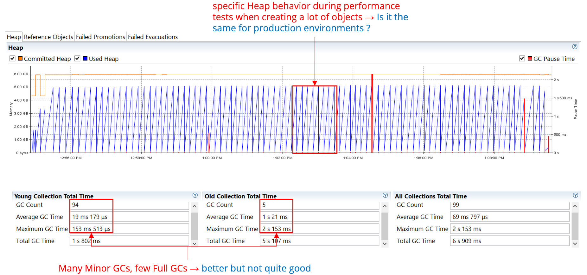

# How to Measure Performance in Java Applications

## Content

- [Metrics](#metrics)
- [Warmup Iterations](#warmup-iterations)
- [Variety of platforms](#variety-of-platforms)
- [Data-lite performance anti-pattern](#data-lite-performance-anti-pattern)
- [Microbenchmark (unit/component level)](#microbenchmark-unitcomponent-level)
- [Macrobenchmark (system level)](#macrobenchmark-system-level)

**Performance** is an important criterion every software application might satisfy and each Architect should have in mind when designing and putting in place the Quality Attribute tactics, if this is an important ASR (Architectural Significant Requirement). Sometimes it becomes really hard to tune and improve a mature and complex application especially because the performance might be influenced by a lot of factors. The key for sorting this out is to know exactly how to isolate and put aside the external components that cannot be improved too much since they are out of the application’s control (e.g. network or middleware systems latency) or parts of the application which must be kept as serial (e.g. see Amdahl’s Law) and to focus on components closer to the developer’s control, subject of improvements. After deciding what exactly should be measured it is important to know how to do that in a proper way. Also, when discussing about measuring performance there are specific characteristics from one programming language to another and it involves a deeper understanding from both software and hardware perspective. In the current article I will try to discuss some guidelines useful to measure performance at the Java application level, independent of any other external systems.

## **Metrics**

When measuring performance, there are two major performance manifestations:

1. Throughput, which is the amount of work per unit of time
2. Response time (sometimes referred as latency) which means how long the operations take

Sometimes it is much easier to improve the throughput (e.g. increasing number of threads and running the algorithm in parallel) but it might get a worse latency (e.g. thread context scheduling causes overhead at the OS level). There are other situations when response time cannot be improved anymore (e.g. it takes 1h to successfully run the algorithm by one thread) instead we can focus on increasing the throughput, because the response time does not matter, it cannot be improved anymore.  
Try to find an acceptable throughput (or response time) as a unit of reference before starting to measure performance. Without a reference it is hard to achieve and improve the application performance.

## **Warmup Iterations**

In all cases do not forget about warmup iterations when testing and measure performance. These iterations should be short and repeatedly triggered in cycles at the beginning of each test in order to reach the code into a steady phase. A good practice is to have around 10 cycles of 15k iterations each (e.g. 15k is the threshold for Just-In-Time C2 Compiler). After this we can be sure the application code is stable, everything is maturely optimized and we can start measuring.

- if the warmup iterations are omitted, the test measures the code interpreted and not compiled. In Java, the compiled code is about 10 times faster than interpreted code.
- if the warmup iterations are not well defined (in terms of number of cycles), when performance is measured, the results might be influenced by Just-In-Time Compiler overhead (since the code is not in a steady phase).

Few of Just-In-Time Compiler optimizations developers should be aware of when starting to measure Java performance:

1. Optimizations and de-optimizations of virtual method calls.  
   This happens when a virtual method call is optimized and inlined but, after a few method invocations, it is de-optimized and re-optimized for another implementation (e.g. imagine there is a method declaration inside an interface with multiple implementations). Such behavior normally happens in the begging of the applications when the Compiler makes a lot of assumptions and does a lot of aggressiveness optimizations / de-optimizations.
2. On-Stack-Replacement (OSR)  
   The Java Virtual Machine starts executing the code in the Interpreter mode. If there is a long running loop inside a method which is interpreted, at some point it becomes hot and it is stopped and replaced by compiled code before the loop completes. There is a slightly difference between Just-In-Time compiled code and OSR compiled code (e.g. code after the loop in the method is not compiled yet hence the method is not fully compiled). That is why generated OSR compiled code should be avoided since it is less frequent in real situation.
3. Loop unrolling and lock coarsening  
   During loop unrolling, compiler will unroll the loops to reduce the number of branches and minimize the cost.  Lock coarsening includes merging adjacent synchronized blocks to perform fewer synchronizations. These optimizations are really powerful and the idea is not that Just-In-Time Compiler optimizes away the benchmark code, but it can apply a different degree of optimization that might not happen in real scenario.

## **Variety of platforms**

Tests results gathered from a single platform might not relevant enough. Even if there is a really good benchmark is recommended to run it on multiple platforms, to collect and compare the results before drawing any conclusions. The diversity of hardware architecture implementations (e.g. Intel, AMD, Sparc) in regards to intrinsics (e.g. compare-and-swap or other hardware concurrency primitives), CPU and memory, could make a difference.

If the variety of platforms is not a handy choice, at least test under an environment less prone to external noise (e.g. no other applications are running and hardware resources like CPU and memory are concurrently shared). Testing under an environment with a volatile number of additional applications would add noise for test results, hence it is recommended to have at least a dedicated test environment closer to production, where the tests can be easily triggered and consistent outputs are obtained.

## **Data-lite performance anti-pattern**

It comes in place especially when applications use caches. For example, a very limited set of test data would bring very good results when measuring the performance under a test environment, because there is a higher change to measure the cache-hit performance ratio rather than having the right volume and variety of data, closer to real system usage.

## **Microbenchmark (unit/component level)**

Testing at unit or component level means to focus on a specific part of the code (e.g. measuring how fast a class method runs) ignoring everything else. In most of the cases such performance tests could become useless because microbenchmarks aggressively optimizes pieces of code in a way that real situation optimizations might not occur (i.e., it is hard to predict the overall impact). This principle is sometimes called testing under microscope.  
For example, during a microbenchmark test in Java HotSpot Virtual Machine there might be optimizations specific to Just-In-Time C2 Compiler but in reality these optimizations won’t happen because the application do not reach that phase, it might run only with Just-In-Tim C1 Compiler.

Microbenchmarking is in general useful for testing standalone components (e.g a sorting algorithm, to add/remove elements to/from lists) but not in a way of slicing a big application into small pieces and test every piece. For big applications I would rather recommend macrobenchmark testing, it provides more accurate results.

Microbenchmarking could be done with different tools, depending on the Java Virtual Machine implementation. For example, the most popular libraries are:

- [Java Microbenchmark Harness (JMH)](https://github.com/openjdk/jmh) – this is tailored to HotSpot VM, unless Compiler options are used
- [Bumblebench](https://github.com/adoptium/bumblebench) – the official one for Eclipse OpenJ9 VM
- [Renaissance Benchmark](https://github.com/renaissance-benchmarks/renaissance) – created for GraalVM but it could be used also for HotSpot VM and Eclipse OpenJ9 VM

## **Macrobenchmark (system level)**

In some cases microbenchmarking the application does not help too much, it does not say anything about the overall throughput or response time of the application. That is why in such cases we have to focus on macrobenchmarks, to write real programs, to develop realistic loads plus environment configurations in order to measure the performance. The dataset test must be similar to the one used in real cases, otherwise a “fake” dataset will create different optimization runtime paths in the code and will end up with a not realistic performance measurements.

One important thing about macro-benchmarks is they might give an unrealistic treatment of Garbage Collectors. For example, during the macrobenchmark test there might be either only Young Generation Collections or extremely fewer Old Generation Collections. Below is an example of Heap behavior during performance tests which create a lot of temporary objects, hence stressing the Young Garbage Collector and creating not-accurate results.

Heap behavior during performance tests when creating a lot of objects

In real applications typical full Garbage Collector cycles might be triggered every hour or so and the test latency added by Garbage Collector is skipped.

Another aspect is that during a macrobenchmark testing I/O and database might not be well benchmarked because in real situations I/O and database are shared resources, hence bottlenecks and delays not captured by test.

When focusing on a macrobenchmarking level do to forget to understand what it is and how [coordinated omission](https://groups.google.com/g/mechanical-sympathy/c/icNZJejUHfE?pli=1) might affect your measurements. It is extremly important to avoid the tools that suffer of this syndrome. Some tools that I used in the past and that I can recommand are:

- [Gatling](https://gatling.io/)
- [wrt2](https://github.com/giltene/wrk2)
