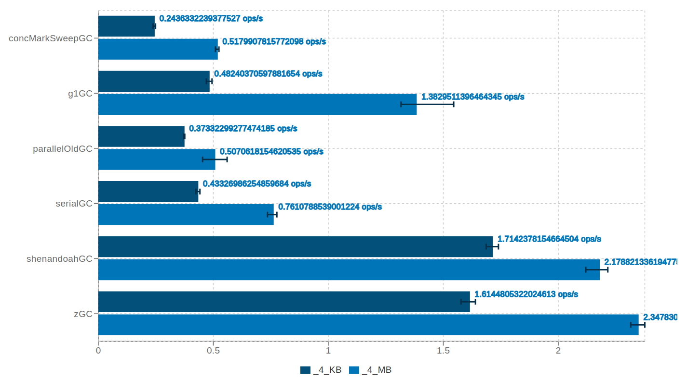
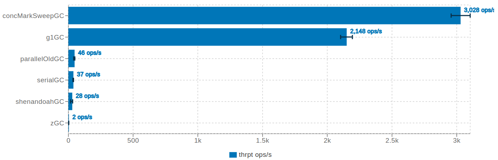
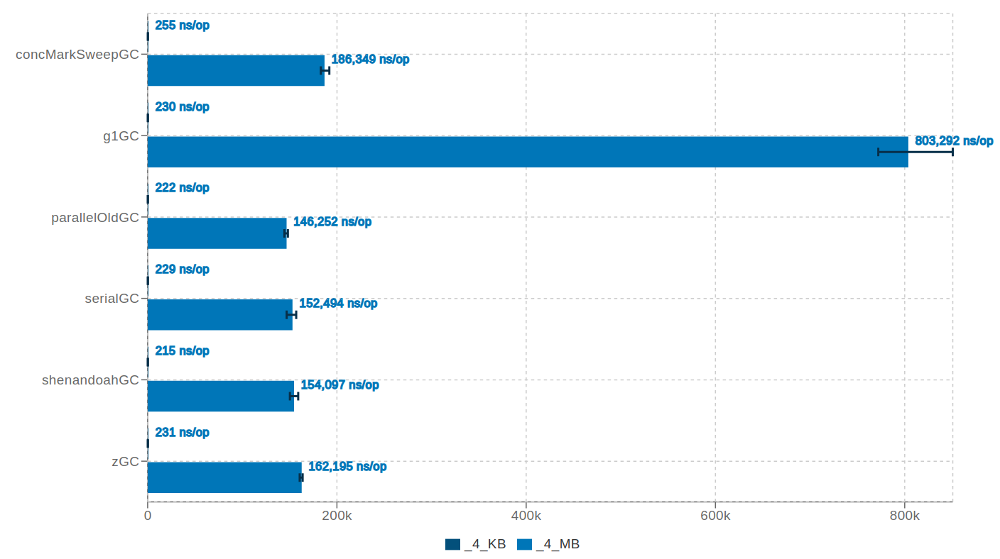
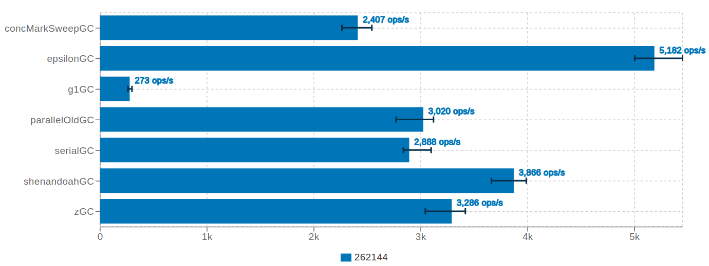
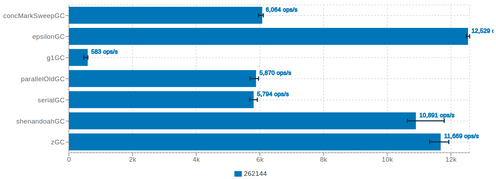
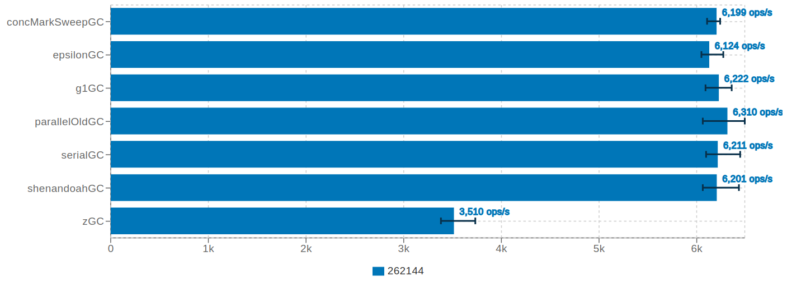
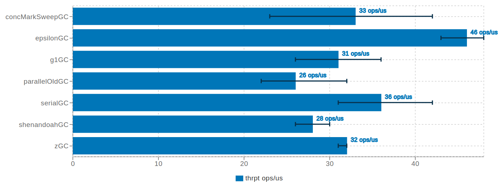

# JVM Garbage Collectors Benchmarks Report 19.12 (OpenJDK 13)

## Content

- [Context](#context)
- [SetUp](#setup)
- [A Bit of Theory](#a-bit-of-theory)
- [Out of Scope](#out-of-scope)
- [Benchmarks](#benchmarks)
- [Final Conclusions](#final-conclusions)
- [Further References](#further-references)

## Context

The current article describes a series of Java Virtual Machine (JVM) Garbage Collectors (GC) micro-benchmarks and their results, using a different set of patterns. For the current issue, I included all Garbage Collectors from **AdoptOpenJDK 64-Bit Server VM version 13 (build 13+33)**:

1. **Serial GC**
2. **Parallel/ParallelOld GC** *(starting Java 7u4 Parallel GC and ParallelOld GC is basically the same Collector)*
3. **Concurrent Mark Sweep (CMS) GC** *(deprecated at the moment, it will be removed in release Java 14, as per [JEP 363](https://openjdk.java.net/jeps/363))*
4. **Garbage First (G1) GC**
5. **Shenandoah GC**
6. **ZGC** *(experimental at the moment)*
7. **Epsilon GC***(experimental at the moment)*

I deliberately chose **AdoptOpenJDK** since not all OpenJDK builds include **Shenandoah GC**. [Andrew Haley](https://twitter.com/AndrewHaley13) offers more details about this in his [post](https://developers.redhat.com/blog/2019/04/19/not-all-openjdk-12-builds-include-shenandoah-heres-why/).

All current GC benchmarks focus on below metrics:

1. the efficiency of a GC objects reclamation under (a) different allocation rates for relatively small and big objects; (b) with or without constant pre-allocated parts of the Heap.
2. the impact of the read/write barriers while traversing and/or updating Heap data structures, trying to avoid any explicit allocation, in the benchmark method, unless it is induced by the underlying ecosystem.
3. the footprint of internal GC native structures.

I would like to mention I am very grateful to [Jean-Phillipe Bempel](http://jean-pillipe%20bempel/) for the initial review and the accurate details he provided, especially on the GC read/write barriers part.

UPDATE: I am also very thankful to [Aleksey Shipilëv](https://twitter.com/shipilev?lang=en) which provided me feedback after I initially published this post. He offered more insights and explanations behind the benchmarks figures (e.g. *ConstantHeapMemoryOccupancyBenchmark*, *ReadBarriersLoopingOverArrayBenchmark*, *WriteBarriersLoopingOverArrayBenchmark*) as well as better clarifications in case of (a) using single-threaded workloads against concurrent GCs and (b) Shenandoah GC goals.

## SetUp

- All benchmarks are written in Java and use [JMH](https://openjdk.java.net/projects/code-tools/jmh/) v1.22
- The benchmarks source code is not public, but I detailed the optimization patterns they rely on.
- Each benchmark uses 5x10s warm-up iterations,  5x10s measurement iterations, 3 JVM forks, and is single-threaded. An important remark is that running single-threaded workloads against concurrent GCs make them look better than stop the world Collectors, because they are able to offload the GC work on otherwise idle CPU cores.
- All benchmarks that target high object allocation rate, set the initial Heap size at the same value with the maximum Heap size but also pre-touches the pages to avoid resizing and memory commit hiccups (e.g. -Xms4g -Xmx4g -XX:+AlwaysPreTouch).
- All tests are launched on a machine having below configuration:
  - CPU: Intel i7-8550U Kaby Lake R
  - MEMORY: 32GB DDR4 2400 MHz
  - OS: Ubuntu 19.04 / 5.0.0-37-generic
- To eliminate the effects of dynamic frequency scaling, I disabled the *intel\_pstate* driver and I set the CPU governor to *performance*.
- Please bear in mind current benchmarks might be influenced by other factors like Just-In-Time Compiler optimizations, the underlying libraries (e.g. JMH), the CPU caching and branch prediction effect, memory allocator subsystem, etc.
- All benchmark results (including the throughput, gc.alloc.rate.norm, gc.count, gc.time, etc.) are merged in a dedicated [HTML report](report/jmh_visualizer_gc/index.html) on my GitHub account. For better charts quality I would recommend opening the [HTML report](report/jmh_visualizer_gc/index.html) since the current post contains only print screens out of it (usually for the throughput measurements). You can also find the [raw benchmarks results](report/) (i.e. JSON test results) under the same repository, on GitHub.

## A Bit of Theory

Before going any further, I would like to briefly include a bit of theory to better understand the upcoming benchmarks.

“**[Garbage collection](https://en.wikipedia.org/wiki/Garbage_collection_(computer_science))** (**GC**) is a form of automatic memory management. The garbage collector, or just collector, attempts to reclaim garbage or memory occupied by objects that are no longer in use by the program”. What is worth it to be mentioned is that a Garbage Collector does also the allocation of the objects, besides their reclamation (for the ones that are no longer reachable).

[**Generational** **GC**](https://www.memorymanagement.org/glossary/g.html#term-generational-garbage-collection) means that data is partitioned into multiple allocation regions (or generations) which are kept separate based on the object age (i.e. the number of survived GC iterations). While some collectors are uni-generational, the others use two heap generations: (1) the Young Generation (further split in Eden and two Survivor regions ) and (2) the Old (or Tenured) Generation.

Uni-generational collectors:

- Shenandoah GC
- ZGC

Two generational collectors:

- Serial GC
- Parallel/ParallelOld GC
- CMS GC
- G1 GC

**Read/write barriers** are a mechanism to execute some extra memory management code when a read/write to an object occurs. These barriers usually affect the performance of the application even if there is no real GC happening (but just reads/writes). Let’s consider the following pseudo-code:

```
// write
object.field = some_other_object

// read
object = some_other_object.field
```

Using the concept of read/write barriers, conceptually it might look something like:

```
write_barrier(object).field = some_other_object
object = read_barrier(some_other_object).field
```

**In regards to the above AdoptOpenJDK Collectors, the read/write barriers are used, as follows:**

- write barriers
  - one write barrier (to track the references from Tenured Generation to Young Generation – e.g. [card table](https://www.memorymanagement.org/glossary/c.html#term-card-marking)) for:
    - Serial GC
    - Parallel/ParallelOld GC
    - CMS GC
  - one write barrier (in case of concurrent marking – e.g. [Snapshot-At-The-Beginning](https://www.memorymanagement.org/glossary/s.html#term-snapshot-at-the-beginning) (SATB)) for:
    - Shenandoah GC
  - two write barriers: (a) first, a PreWrite barrier, in case of concurrent marking (e.g. SATB), and (b) second, a PostWrite barrier, to track not only the references from Tenured Generation to Young Generation but any cross-region references (e.g. Remembered Sets) for:
    - G1 GC
- read barriers
  - Shenandoah GC
    - when accessing fields of an object through a reference (i.e. Brooks pointer dereferencing for every access) in case of OpenJDK versions <= 12
    - when references are loaded from the heap (i.e. Load Reference Barrier (LRB)) in case of OpenJDK versions >= 13
  - ZGC, when references are loaded from the Heap
- no barriers
  - Epsilon GC does not use any barrier at all and it could be used as a baseline for all other Collectors

## Out of Scope

- Any further detail about how each Garbage Collector works. There is plenty of such material on the internet (e.g. presentations, books, blogs, etc.), way better presented than I could have probably written.
- Any other JVM implementation and GC type (at least at the moment).
- Any other JVM Heap size except 4GB.
- Any further detailed explanation of why benchmark X is better or worse than benchmark Y, beyond the reported JHM timings. However, I can make the sources available to any HotSpot engineer who might be interested in reproducing the scenario and analyzing it further.
- Any end to end macro-benchmark test on a real application. This might be probably the most representative, nevertheless, the current focus is on the micro-level benchmarks.

## Benchmarks

### **BurstHeapMemoryAllocatorBenchmark**

This benchmark creates a lot of temporary objects, keeps strong references to them (in an ArrayList) until it fills up a certain percent of Heap occupancy and then releases them (i.e. calls blackhole.consume()), so they all suddenly become eligible for Garbage Collector.

```java
void allocate(int sizeInBytes, int numberOfObjects) {
  for (int iter = 0; iter < 4; iter++) {
    List<byte[]> junk = new ArrayList<>(numberOfObjects);
    for (int j = 0; j < numberOfObjects; j++) {
      junk.add(new byte[sizeInBytes]);
    }
    blackhole.consume(junk);
  }
}
```

Where:

- **sizeInBytes** is:
  - \_4\_KB
  - \_4\_MB
- **numberOfObjects** is automatically calculated to consume up only 60% of the available Heap memory

[](./BurstHeapMemoryAllocatorBenchmark.png)<< click on the picture to enlarge or open the full [HTML report](report/jmh_visualizer_gc/index.html) from GitHub >>

#### Conclusions

- ZGC and Shenandoah GC perform significantly better than all the other Collectors.
- G1 GC offers a worse throughput than ZGC and Shenandoah GC, however, it behaves noticeably better than CMS GC, ParallelOld GC, and Serial GC in case of \_4\_MB objects (i.e. humongous objects, as per G1 terminology).

### **ConstantHeapMemoryOccupancyBenchmark**

This benchmark initially allocates (during setup) a lot of objects, as a pre-allocated part of the Heap, and keeps strong references to them until it fills up a certain percent of heap occupancy (e.g. 70%). The pre-allocated objects consist of a big chain of composite classes (e.g. class C1 -> class C2 -> … -> class C32). This might have an impact on the GC roots traversal (for example during the “parallel” marking phase) since the degree of pointer indirection (i.e. reference processing) while traversing the object graph is not negligible.

Then, in the benchmark test method, temporary objects are allocated (of size 8 MB) and immediately released, so they soon become eligible for Garbage Collector. Since these are considered big objects, they would normally follow the slow path allocation, residing directly in the Tenured Generation (in case of generational collectors), increasing the likelihood of full GCs.

```
void test(Blackhole blackhole) {
  blackhole.consume(new byte[_8_MB]);
}
```

[](./ConstantHeapMemoryOccupancyBenchmark.png)  
<< click on the picture to enlarge or open the full [HTML report](report/jmh_visualizer_gc/index.html) from GitHub >>

#### Conclusions

- CMS GC followed by G1 GC perform significantly better than all the others.
- ZGC and Shenandoah GC offer the worst throughput.

For ZGC and Shenandoah GC, this is explained by the cost of marking the entire heap on every cycle to reclaim the garbage. In the case of a single generation GC, collecting (the easy) garbage still requires marking through the entire pre-allocated objects that are reachable. It might be partially mitigated by increasing the number of concurrent GC threads using **-XX:ConcGCThreads=<n>**. Otherwise, it is the job of a generational GCs to skip the rest of the heap when collecting (the easy) garbage.

ParallelOld GC and Serial GC fall into premature full GCs syndrome caused by the humongous allocations (e.g. byte arrays of 8 MB size). Nevertheless, premature full GCs might be also caused by non-humongous allocations, as well.

In the case of G1 GC, humongous allocations have a specific treatment (i.e. they are allocated into dedicated regions) and starting Java 8u40 are collected during Evacuation pause (at every Young GC).

### **HeapMemoryBandwidthAllocatorBenchmark**

This benchmark tests the allocation rate for different chunks of allocation sizes. In comparison to the previous benchmark (e.g. *ConstantHeapMemoryOccupancyBenchmark*), it just allocates temporary objects and immediately releases them, without keeping any pre-allocated objects.

```
byte[] allocate() {
  return new byte[sizeInBytes];
}
```

Where:

- **sizeInBytes** is:
  - \_4\_KB
  - \_4\_MB

[](./HeapMemoryBandwidthAllocatorBenchmark.png)

<< click on the picture to enlarge or open the full [HTML report](report/jmh_visualizer_gc/index.html) from GitHub >>

#### Conclusions

- for bigger objects (e.g. \_4\_MB) G1 GC offers the worst response time (around 5x times slower than all the other Collectors) and ParallelOld GC seems to be the most efficient.
- for relatively small objects (e.g. \_4\_KB) the results are almost the same, slightly in favor of Shenandoah GC, but not by a relevant difference.

### **ReadWriteBarriersBenchmark**

Test the overhead of read/write barriers while iterating through an array of Integers and exchanging the values between each two of them (i.e. array[i] <-> array[j]). The array of Integers is initialized during the setup, hence in the benchmark test method, the number of allocations are almost non-existing.

```
void test() {
  int lSize = size;
  int mask = lSize - 1;

  for (int i = 0; i < lSize; i++) {
    Integer aux = array[i];
    array[i] = array[(i + index) & mask];
    array[(i + index) & mask] = aux;
  }

 index++;
}
```

[](./ReadWriteBarriersBenchmark.png)  
<< click on the picture to enlarge or open the full [HTML report](report/jmh_visualizer_gc/index.html) from GitHub >>

#### Conclusions

- Epsilon GC, since it does not use any read/write barrier, offers the best throughput. It was included just to have a baseline for the other Collectors.
- Shenandoah GC seems to perform better than any other Collector (except Epsilon GC, of course).
- G1 GC offers the worst throughput, about ~10x-14x slower than the rest. In such a case, the PostWrite barriers (i.e. Remembered Sets management across G1 regions) might be the reason behind.

### **WriteBarriersLoopingOverArrayBenchmark**

Test the overhead of write barriers while iterating through the elements of an array of Integers and updating every element of it. The number of allocations in the benchmark test method is kept to zero.

```
void test(Integer lRefInteger) {
  int lSize = size;

  for (int i = 0; i < lSize; i++) {
    array[i] = lRefInteger;
  }
}
```

[](./WriteBarriersLoopingOverArrayBenchmark.png)<< click on the picture to enlarge or open the full [HTML report](report/jmh_visualizer_gc/index.html) from GitHub >>

#### Conclusions

- Epsilon GC, since it does not use any read/write barrier, offers the best throughput. It was included just to have a baseline for the other Collectors.
- ZGC seems to perform better than any other Collector (except Epsilon GC, of course).
- G1 GC offers the worst throughput, about ~10x-20x slower than the rest. Most probably it has the same root cause as in the previous benchmark (i.e. PostWrite barriers overhead).

A subtle difference is made here, in favor of ZGC, by the lack of [Compressed OOPs](https://wiki.openjdk.java.net/display/HotSpot/CompressedOops). For other Collectors (including Shenandoah GC), accessing Compressed OOPs takes a small fee. Since ZGC does not support Compressed OOPs it has the advantage here.

### **ReadBarriersLoopingOverArrayBenchmark**

Test the overhead of read barriers while iterating through the elements of an array of Integers and reading every element of it. As a side-effect of this benchmark is also the unboxing effect (i.e. the conversion between int <- Integer).

**Note**: looping over an array favors the algorithms that can hoist the barrier without accounting really on the cost of the barrier itself.

```
int test() {
  int lSize = size;

  int sum = 0;
  for (int i = 0; i < lSize; i++) {
    sum += array[i];
  }

  return sum;
}
```

[](./ReadBarriersLoopingOverArrayBenchmark.png)<< click on the picture to enlarge or open the full [HTML report](report/jmh_visualizer_gc/index.html) from GitHub >>

#### Conclusions

- ZGC offers the lowest throughput. It might be explained, apparently, by two things: (1) not being able to hoist the read barrier check and (2) the absence of Compressed OOPs which now it strikes the other way around (in comparison to the previous benchmark; e.g. *WriteBarriersLoopingOverArrayBenchmark*). Since the array of Integers is large enough there are fewer chances to fit in CPU caches.
- in all the other cases the results are quite similar, which in essence emphasizes the fact Shenandoah GC does a better job at optimizing the LRB by hoisting it outside of the loop (and of course the presence of Compressed OOPs matters). As a reminder, all other Collectors (e.g. Serial GC, ParallelOld GC, CMS GC, G1 GC, Epsilon GC) do not use any read barrier.

While the read barrier hoisting might be fixed in later releases, the absence of Compressed OOPs is the design constraint in the case of ZGC.

### **ReadBarriersChainOfClassesBenchmark**

Test the overhead of read barriers while iterating through a big chain of pre-allocated composite class instances (e.g. class H1 -> class H2 -> … -> class H32) and returns a field property held by the innermost of them.

```
int test() {
  return  h1.h2.h3.h4.h5.h6.h7.h8
         .h9.h10.h11.h12.h13.h14.h15.h16
         .h17.h18.h19.h20.h21.h22.h23.h24
         .h25.h26.h27.h28.h29.h30.h31.h32.aValue;
}

// where:
class H1 {
  H2 h2;

  H1(H2 h2) {
    this.h2 = h2;
  }
}

// ...

class H32 {
  int aValue;

  public H32(int aValue) {
    this.aValue = aValue;
  }
}
```

[](./ReadBarriersChainOfClassesBenchmark.png)<< click on the picture to enlarge or open the full [HTML report](report/jmh_visualizer_gc/index.html) from GitHub >>

#### Conclusions

- Epsilon GC, since it does not use any read/write barrier, offers the best throughput. It was included just to have a baseline for the other Collectors.
- in all the other cases the throughput is rather the same, not a noticeable difference.

### **NMTMeasurementsMain**

This scenario runs a simple “Hello World” Java program that, at the end of the JVM lifetime, prints the size of internal GC native structures needed for Heap management. Such structures might be:

- Mark Bitmap – needed to mark reachable Java objects
- Mark Stack – needed by the GC algorithm itself to traverse the object graph
- Remembered Sets – needed to track cross-region references (in case of G1 GC)

The test relies on the [Native Memory Tracking](https://docs.oracle.com/javase/8/docs/technotes/guides/troubleshoot/tooldescr007.html) (NMT) which tracks (i.e. instruments) the internal JVM allocations and reports the GC native structures footprint.

```java
public class NMTMeasurementsMain {
  public static void main(String []args) {
    System.out.println("Hello World");
  }
}
```

The “Hello World” Java program is launched multiple times, every time by specifying a different GC type, using the following JVM arguments pattern:

```shell
-XX:+UnlockDiagnosticVMOptions -XX:+Use<Type>GC -XX:+PrintNMTStatistics -XX:NativeMemoryTracking=summary -Xms4g -Xmx4g -XX:+AlwaysPreTouch
```

Where:

- **Type** is {Serial, ParallelOld, ConcMarkSweep, G1, Shenandoah, Z, Epsilon}

Below is the aggregated output for all runs:

```
// Serial GC
(reserved=13_694KB, committed=13_694KB)
(malloc=34 KB)
(mmap: reserved=13_660KB, committed=13_660KB)

// ParallelOld GC
(reserved=182_105KB, committed=182_105KB)
(malloc=28_861KB)
(mmap: reserved=153_244KB, committed=153_244KB)

// CMS GC
(reserved=34_574KB, committed=34_574KB)
(malloc=19_514KB)
(mmap: reserved=15_060KB, committed=15_060KB)

// G1 GC
(reserved=216_659KB, committed=216_659KB)
(malloc=27_711KB)
(mmap: reserved=188_948KB, committed=188_948KB)

// Shenandoah GC
(reserved=136_082KB, committed=70_538KB)
(malloc=4_994KB)
(mmap: reserved=131_088KB, committed=65_544KB)

// ZGC
(reserved=8_421_751KB, committed=65_911KB)
(malloc=375KB)
(mmap: reserved=8_421_376KB, committed=65_536KB)

// Epsilon GC
(reserved=29KB, committed=29KB)
(malloc=29KB)
```

<< click [here](report/NMTMeasurementsMain.out) to open the full NMT summary report from GitHub >>

Legend:

- **committed**: address ranges that have been mapped with something other than PROT\_NONE
- **reserved**: the total address range that has been pre-mapped for a particular memory pool

#### Conclusions

- every GC has a different memory footprint to hold its internal GC native structures. While this might be influenced by the Heap size (i.e. increasing/decreasing the Heap size might also increase/decrease the GC native structures footprint) it is quite obvious all GCs need additional native memory for Heap management.
- excluding Epsilon GC, the smallest footprint belongs to Serial GC, followed by CMS GC, ZGC, Shenandoah GC, ParallelOld GC, and G1 GC.

## Final Conclusions

Please do not take this report too religiously, it is far from covering all possible use cases. In addition, some of the benchmarks might have flaws, others might need additional effort to deep-dive and try to understand the real cause behind the figures (which is out of scope). Even so, I think it gives you a broader understanding and proves that no Garbage Collector fits all the cases. There are pros and cons on each side, each has its own strengths and weaknesses.

It is very difficult to provide general conclusions based on the current set of benchmarks and this particular setup. Nevertheless, I would try to summarize it as:

- in the case of G1 GC the management of Remembered Sets has a significant overhead.
- Compressed OOPs is a double-edged sword. Nevertheless, in the case of Heap sizes up to 32 GB and on 64-bit platforms and it brings an advantage in favor of Collectors that support it, excepting ZGC which has it disabled by design.
- ZGC and Shenandoah GC seem to be very efficient when big bursts of allocated instances (taking around 60% of Heap size) becomes eligible for reclamation.
- ParallelOld GC does a very good job of reclaiming short-lived allocated objects when the Heap does not contain a lot of other strongly reachable instances that could survive between GC iterations.
- CMS GC and G1 GC seem to provide a better throughput while reclaiming temporary big allocated objects (e.g. 8\_MB) when a significant part of the Heap (around 70%) is constantly being occupied, hence there are strongly reachable instances that survive between GC iterations.

Even though, some general GC characteristics might give you a glimpse about which one could be a better fit for your application:

- Serial GC has the smallest footprint and is probably a reference implementation (i.e. simplest GC algorithm).
- ParallelOld GC tries to optimize for high throughput.
- G1 GC strives for a balance between throughput and law pause times.
- ZGC struggles for as low pause times as possible (e.g. max 10ms) and is designed to scale incredibly better from smaller to big Heap sizes (i.e. from hundreds of MB to many TB).
- Shenandoah GC has similar goals as ZGC, it targets low pause times which are no longer directly proportional to the Heap size and is supposed to scale from tiny to big Heap sizes.

I hope you have enjoyed reading it, despite the length. If you find this useful or interesting, I would be very glad to have your feedback (in terms of missing use cases, unclear explanations, etc.) or, if you want to contribute with different benchmark patterns please do not hesitate to [get in touch](https://ionutbalosin.com/contact/).

If you are interested in Just In Time (JIT) Compiler benchmarks, in addition to the current GC benchmarks, please visit my previous article .

## Further References

- [Shenandoah GC Wiki](https://wiki.openjdk.java.net/display/shenandoah/)
- [JEP 333: ZGC – A Scalable Low-Latency Garbage Collector](https://openjdk.java.net/jeps/333)
- [ZGC – Low Latency GC for OpenJDK](https://www.youtube.com/watch?v=tShc0dyFtgw) – Stefan Karlsson and Per Liden
- [Understanding Low Latency JVM GCs](https://www.youtube.com/watch?v=MU8NapbG1IQ) – Jean-Philippe Bempel
- [Write Barriers in G1 GC](https://www.jfokus.se/jfokus17/preso/Write-Barriers-in-Garbage-First-Garbage-Collector.pdf) – by Monica Beckwith
- [Intergenerational Barriers](https://shipilev.net/jvm/anatomy-quarks/13-intergenerational-barriers/) – by Aleksey Shipilëv
