# JVM JIT Compilers Benchmarks Report 19.11 (OpenJDK 13)

## Content

- [Context and Motivation](#context-and-motivation)
- [SetUp](#setup)
- [Out of Scope](#out-of-scope)
- [Benchmarks](#benchmarks)
- [Final Conclusions](#final-conclusions)

## Context and Motivation

The current article describes a series of Java Virtual Machine (JVM) Just In Time (JIT) Compilers micro-benchmarks and their results, relying on different optimization patterns or intrinsics support. For the current issue, I included two compilers from **OpenJDK 64-Bit Server VM version 13 (build 13+33)**

1. **C1/C2 JIT**
2. **Graal JIT**

From my point of view, this comparison makes sense, even if C1/C2 JIT is not a state of the art Compiler (in comparison to Graal JIT). However, the majority of Java applications still run using C1/C2 JIT. In OpenJDK, the baseline for Graal JIT remains C2 JIT. The target is to leverage its performance to be at least on par with C2 JIT, especially on real-world applications production code.

After I published the [first release](https://ionutbalosin.com/2019/04/jvm-jit-compilers-benchmarks-report-19-04/) of this report series, I noticed it raised huge interest which made me think it is something I should continue working on. As a consequence, the current report is an extension of the previous one, containing even more benchmarks (approx. 400 in total). I am also very thankful to the reviewers and the general feedback I received after I published the first report ([Volker Simonis](https://twitter.com/volker_simonis), [Gil Tene](https://twitter.com/giltene), [Philip Reames](https://twitter.com/philip_reames), [Chris Newland](https://twitter.com/chriswhocodes), [Oleg Šelajev](https://twitter.com/shelajev))

## SetUp

- All benchmarks are written in Java and use [JMH](https://openjdk.java.net/projects/code-tools/jmh/) v1.21
- The benchmarks source code is not (yet) public, but I detailed the optimization patterns they rely on.
- Each benchmark uses 5x10s warm-up iterations,  5x10s measurement iterations, 3 JVM forks, and is single-threaded.
- All tests are launched on a machine having below configuration:
  - CPU: Intel i7-8550U Kaby Lake R
  - MEMORY: 32GB DDR4 2400 MHz
  - OS: Ubuntu 18.10 / 4.18.0-17-generic
- To eliminate the effects of dynamic frequency scaling, I disabled the *intel\_pstate* driver and I set the CPU governor to *performance*.
- All benchmark test data structures fit within L1-L3 cache: usually, they are bigger than L1d (32KB) but smaller than L3 (8192KB). Nevertheless, benchmark results are anyway influenced by data sizes (which has also an impact on the CPU caches, branch predictors, etc).
- All benchmark results are merged in a dedicated [HTML report](report/jmh_visualizer_jit/index.html) on my GitHub account. For better charts quality I would recommend you open the [HTML report](report/jmh_visualizer_jit/index.html) since the current post contains only print screens out of it. Also, you can find the [raw benchmarks results](report/) (JSON test results) under the same repository on GitHub.

## Out of Scope

- Any commercial JVM (at least at the moment).
- Any further detailed explanation of why benchmark X is better or worse than benchmark Y, beyond the reported JHM timings. However, I can make available the sources to any Compiler engineer might be interested in reproducing the scenario and analyzing it further.
- Any end to end macro-benchmark test on a real application. This might be probably the most representative, nevertheless, the current focus is on the micro-level benchmarks.
- In some corner cases, the number of warm-up iterations might not be sufficient in case of Graal JIT (which usually needs longer warm-up iterations than C1/C2 JIT), but IMHO the current setup (with -wi 5 -w 10 -i 5 -r 10 -f 3) should be enough for the majority of the benchmarks.
- Benchmarks where the results between Graal JIT and C1/C2 JIT were identical or very close. If you are interested in all test cases, please open the [HTML report](report/jmh_visualizer_jit/index.html)

## Benchmarks

### **IfConditionalBranchBenchmark**

Tests the optimization of an if conditional branch within a loop based on a predictable or unpredictable branch pattern.

```
for (int value : array) {
  if (value < thresholdLimit) {
    sum += value;
  }
}
```

Where **thresholdLimit** is:

- always greater then arrays values – predictable pattern
- partially greater than some random arrays values – unpredictable pattern

[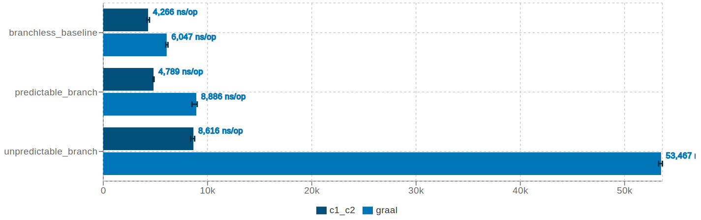](./19_11_IfConditionalBranchBenchmark.png)

<<click on the picture to enlarge or open the full [HTML report](report/jmh_visualizer_jit/index.html) from GitHub >>

#### Conclusions

- in the case of **branchless\_baseline** and **predictable\_branch** both compilers perform almost the same (slightly better in favor of C1/C2 JIT).
- in the case of **unpredictable\_branch** C1/C2 JIT reaches around 6.1x performance speedup.

#### Winner

- C1/C2 JIT

### **NullChecksBenchmark**

Test how the Compiler deals with implicit versus explicit null pointer exception while accessing the elements of an array list. The values inside the array are generated, as follows:

- Case I: all are different than null, hence none throws NPE
- Case II: only a part of them are null, hence only a part of them throw NPE
- Case III: all of them are null, hence all throw NPE

```java
method() {
  for (Object object : elements) {
    try {
      // mode is {explicit, implicit}
      <mode>_null_check(object);
    } catch(NullPointerException e) {
      // swallow exception
    }
  }
}

explicit_null_check(object) {
  if (object == null) {
    throw new NullPointerException("Oops!");
  }
  return object.field;
}

implicit_null_check(object) {
  return object.field; // might throw NPE
}
```

[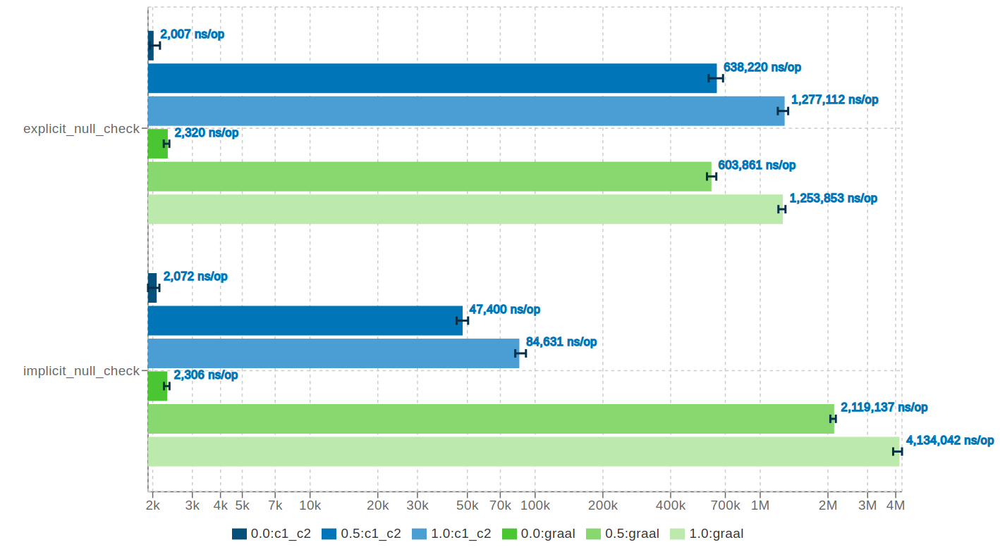](./19_11_NullChecksBenchmark.png)

<<click on the picture to enlarge or open the full [HTML report](report/jmh_visualizer_jit/index.html) from GitHub >>

#### Conclusions

- in the case of **explicit\_null\_check** both compilers perform almost the same.
- in the case of **implicit\_null\_check** when only a part of the array elements throws NPE (case II) or all throws NPE (case III), C1/C2 JIT reaches around 45x performance speedup.

#### Winner

- C1/C2 JIT

### **ScalarReplacementBenchmark**

Compiler analyses the scope of a new object and decides whether it might be allocated or not on the heap. The method is called **Escape Analysis** (EA), which identifies if the newly created object is escaping or not into the heap. To not be confused, EA is not an optimization but rather an analysis phase for the optimizer. There are few escape states:

- **NoEscape** – the object cannot be visible outside the current method and thread.
- **ArgEscape** – the object is passed as an argument to a method but cannot otherwise be visible outside the method or by other threads.
- **GlobalEscape** – the object can escape the method or the thread. It means that an object with GlobalEscape state is visible outside method/thread.

For **NoEscape** objects, the Compiler can remap accesses to the object fields to accesses to synthetic local operands: which leads to so-called **Scalar Replacement** optimization. If stack allocation was really done, it would allocate the entire object storage on the stack, including the header and the fields, and reference it in the generated code. However, since the operands are handled by register allocator, some may claim stack slots (get “spilled”) and it might look like the object field block is allocated on stack. Please check this [article](https://shipilev.net/jvm/anatomy-quarks/18-scalar-replacement/) for further details.

```
no_escape_object() {
  SimpleObject object = new SimpleObject();

  return object.field1 + object.field2;
}

no_escape_object_containing_array() {
  ObjectWithArray object = new ObjectWithArray();

  return object.field1 + object.field2 + object.array.length;
}

partial_escape_object_containing_array() {
  ObjectWithArray object = new ObjectWithArray();

  if (predicate) // always FALSE
    result = object;
  else
    result = otherGlobalObject;

return result;
}
```

Where:

- **predicate** is always evaluated to FALSE, at runtime.
- array size is 128.

```
arg_escape_object_containing_array() {
  ObjectWithArray object1 = new ObjectWithArray();
  ObjectWithArray object2 = new ObjectWithArray();

  if (object1.equals(object2)) // inlining candidate
    match = true;
  else
    match = false;

  return match;
}
```

Where:

- **object1** is **NoEscape**
- **object2** is:
  - **NoEscape** if inlining of equals() succeeds.
  - **ArgEscape** if inlining fails or is disabled.

[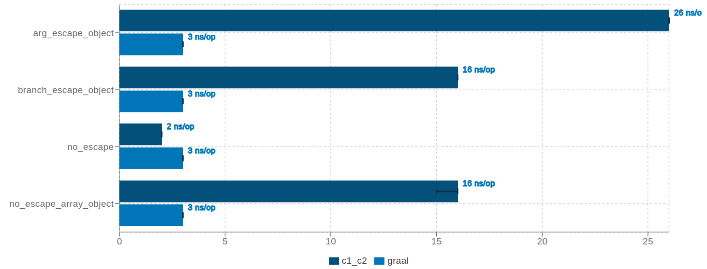](./19_11_ScalarReplacementBenchmark.png)

<<click on the picture to enlarge or open the full [HTML report](report/jmh_visualizer_jit/index.html) from GitHub >>

#### Conclusions

- in all cases, Graal JIT is able to get rid of heap allocations offering a constant response time, around 3 ns/op. In comparison, C1/C2 JIT achieves that only for the **no\_escape\_object** case.
- C1/C2 JIT by default does not consider escaping arrays if their size (i.e. the number of elements) is greater than 64, but this could be tuned via **-XX:EliminateAllocationArraySizeLimit** JVM argument. In my benchmark the array size is 128, hence EA was omitted. Besides that, C1/C2 JIT struggles to get rid of the heap allocations if the object scope, after inlining, becomes local (i.e. NoEscape), or if there is a condition that does not make obvious at compile time if the object escapes or not (i.e. partial escape analysis).

More details about Partial Escape Analysis and Scalar Replacement can be found in this [paper](http://www.ssw.uni-linz.ac.at/Research/Papers/Stadler14/Stadler2014-CGO-PEA.pdf).

#### Winner

- Graal JIT

### **DoubleMathBenchmark**

Tests a bunch of mathematical operations while iterating through a list (or multiple lists) of randomly generated doubles.

```
double[] A, B, C, R;
R[i] = Math.sqrt(A[i]);

R[i] = Math.exp(A[i]);

R[i] = Math.pow(A[i], B[i]);

R[i] = Math.log(A[i]);

R[i] = Math.log10(A[i]);

R[i] = Math.abs(A[i]);

R[i] = Math.min(A[i], B[i]);

R[i] = Math.max(A[i], B[i]);

R[i] = Math.fma(A[i], B[i], C[i]);

R[i] = Math.round(A[i]);

R[i] = Math.floor(A[i]);

R[i] = Math.ceil(A[i]);

R[i] = Math.sin(A[i]);

R[i] = Math.cos(A[i]);
```

The current benchmark also exploits the [vectorization effect](https://en.wikipedia.org/wiki/Automatic_vectorization), however, there are other dedicated test cases in the current report.

[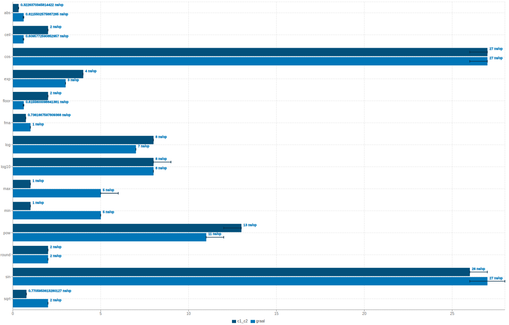](./19_11_DoubleMathBenchmark.png)

<<click on the picture to enlarge or open the full [HTML report](report/jmh_visualizer_jit/index.html) from GitHub >>

#### Conclusions

- in the cases of **max**, **min**, and **sqrt**, C1/C2 JIT performs better.
- in the cases of **ceil**, **exp**, **floor**, **pow**, Graal JIT performs better.
- in all the other cases both compilers perform almost the same

**Note:** the difference might be also induced by loop optimizations (e.g. unrolling, vectorization) since the benchmark triggers the math operations within a loop and then divides the average response time by the number of operations per invocation.

### **VectorizationPatternsSingleIntArrayBenchmark**

Test different vectorization patterns using an array of ints. All loops have stride 1 and the loop counter is of type int or long.

```
int[] A;

// sum_of_all_array_elements
sum += A[i];

// sum_of_all_array_elements_long_stride
sum += A[l];

// sum_of_all_array_elements_by_adding_a_const
sum += A[i] + CONST;

// sum_of_all_even_array_elements
if ( (A[i] & 0x1) == 0 ) {
  sum += A[i];
}

// sum_of_all_array_elements_matching_a_predicate
if (P[i]) {
  sum += A[i];
}

// sum_of_all_array_elements_by_shifting_and_masking
sum += (A[i] >> SHIFT) & MASK;

// multiply_each_array_element_by_const
A[i] = A[i] * CONST;

// add_const_to_each_array_element
A[i] = A[i] + CONST;

// shl_each_array_element_by_const
A[i] = A[i] << CONST;

// mod_each_array_element_by_const
A[i] = A[i] % CONST;

// saves_induction_variable_to_each_array_element
A[i] = i;

// increment_arrays_elements_backward_iterator (i=n-1...0)
A[i] = i;
```

[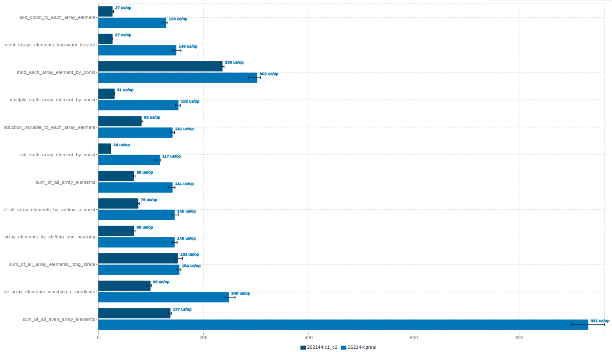](./19_11_VectorizationPatternsSingleIntArrayBenchmark.png)

<<click on the picture to enlarge or open the full [HTML report](report/jmh_visualizer_jit/index.html) from GitHub >>

#### Conclusions

- the **sum\_of\_all\_array\_elements\_long\_stride** case is similar for both compilers. See the note below.
- in all the other cases C1/C2 JIT offers better performance.

**Note**: in case of loops with a long stride (even if the stride is 1) the body of the loop is not unrolled and the loop itself contains a safepoint poll, which slows down the performance.

#### Winner

- C1/C2 JIT

### **VectorizationPatternsMultipleFloatArraysBenchmark**

Tests different vectorization patterns using multiple arrays of floats. All loops have stride 1 (or 2) and the loop counter is of type int or long.

```
float[] A, B, R;
short[] S;

// sum_all_product_pairs_of_2_arrays_elements
sum += A[i] * B[i];

// add_2_arrays_elements
R[i] = A[i] + B[i];

// extract_2_arrays_elements
R[i] = A[i] - B[i];

// mod_2_arrays_elements
R[i] = A[i] % B[i];

// multiply_2_arrays_elements
R[i] = A[i] * B[i];

// multiply_2_arrays_elements_of_mixed_types
R[i] = A[i] * S[i]; (A - float[] and S - short[])

// multiply_2_arrays_elements_backward_iterator
C[i] = A[i] * B[i]; // i = n-1 ... 0

// multiply_2_arrays_elements_unknown_trip_count
R[i] = A[i] * S[i]; // but the trip is not known

// divide_2_arrays_elements
R[i] = A[i] / B[i];

// if_with_masking_conditional_flow
if (A[i] >= 0.f)
  R[i] = CONST * A[i];
else
  R[i] = A[i];

// multiply_2_arrays_elements_long_stride
R[(int) l] = A[(int) l] * B[(int) l]

// multiply_2_arrays_elements_stride_x2
R[2 * i] = A[2 * i] * B[2 * i];

// multiply_2_arrays_elements_stride_2
R[i + 2] = A[i + 2] * B[i + 2];

// add_2_arrays_elements_inc_index_access
A[i] = A[i + 1] + B[i];

// add_2_arrays_elements_modulo_index_access
R[i] = A[i % 2] + B[i];
```

[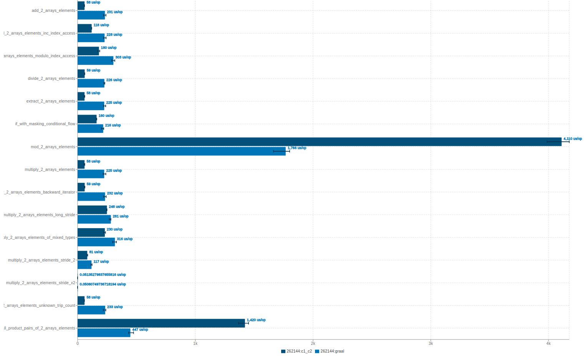](./19_11_VectorizationPatternsMultipleFloatArraysBenchmark.png)

<<click on the picture to enlarge or open the full [HTML report](report/jmh_visualizer_jit/index.html) from GitHub >>

#### Conclusions

- for the **mod\_2\_arrays\_elements** and **sum\_all\_product\_pairs\_of\_2\_arrays\_elements** cases, Graal JIT performs better reaching around 2x-3x performance speedup.
- the **multiply\_2\_arrays\_elements\_long\_stride** case is similar for both compilers (due to the rationale already explained – loops with long stride).
- in all the other cases C1/C2 JIT offers better performance.

#### Winner

- C1/C2 JIT

### **VectorizationPatternsMultipleIntArraysBenchmark**

Tests different vectorization patterns using multiple arrays of ints. All loops have stride 1 (or 2) and the loop counter is of type int or long.

Benchmark use cases are similar to the ones from **VectorizationPatternsMultipleFloatArraysBenchmark**, hence no need to duplicate them anymore.

[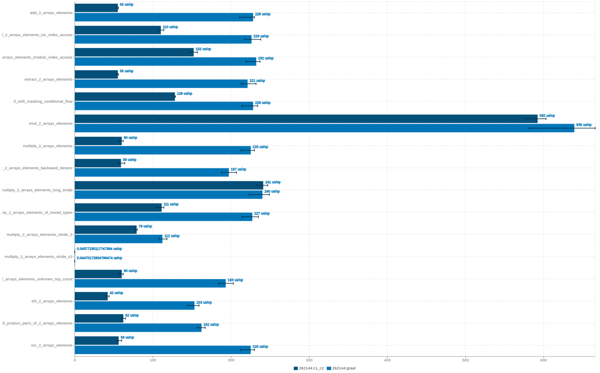](./19_11_VectorizationPatternsMultipleIntArraysBenchmark.png)

<<click on the picture to enlarge or open the full [HTML report](report/jmh_visualizer_jit/index.html) from GitHub >>

#### Conclusions

- except for the **multiply\_2\_arrays\_elements\_long\_stride**case (due to the rationale already explained – i.e. loops with long stride), in all the other cases C1/C2 JIT performs better.

#### Winner

- C1/C2 JIT

### **VectorizationScatterGatherPatternBenchmark**

[Gather-scatter](https://en.wikipedia.org/wiki/Gather-scatter_(vector_addressing)) is a type of memory addressing that often arises when addressing vectors in sparse linear algebra operations.

Vector processors (and some SIMD units in CPUs) have hardware support for gather-scatter operations, providing instructions such as Load Vector Indexed for **gather** and Store Vector Indexed for **scatter**.

```
int[] A, B, C, R;

// scatter_gather
R[i] = C[i] + A[B[i]];
```

[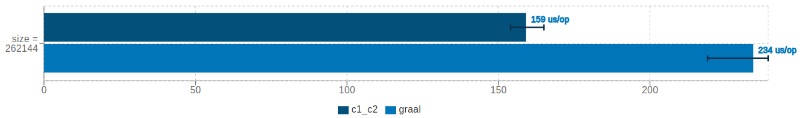](./19_11_VectorizationScatterGatherPatternBenchmark.png)

<<click on the picture to enlarge or open the full [HTML report](report/jmh_visualizer_jit/index.html) from GitHub >>

#### Conclusions

- C1/C2 JIT reaches around 1.4x performance speedup.

#### Winner

- C1/C2 JIT

### **CodeCacheBusterBenchmark**

Tests the compilation (i.e. the code cache) of a big method which calls in sequence a bunch of other small methods (~5,000 small methods).

Every small method either returns the received argument incremented by a random value or dispatches it to another small method which returns another random value. The big method counts around 40,002 bytes in total, where every small method has either 8 or 12 bytes.

As a side note, HotSpot has a **HugeMethodLimit** threshold which is set to 8,000 bytes, which means methods larger than this threshold are not implicitly compiled, unless JVM argument **-XX:-DontCompileHugeMethods** is enabled.

```
method() { // size = 40002 bytes
  int sum = 0;
  sum += t0(sum);
  sum += t1(sum);
  // ...
  sum += t4999(sum);
  return sum;
}

int t0(int i) { // size = 8 bytes
  return i + t1(i);
}

int t1(int i) { // size = 12 bytes
  return i + random.nextInt(10);
}

// ...

int t4999(int i) { // size = 12 bytes
  return i + random.nextInt(10);
}
```

[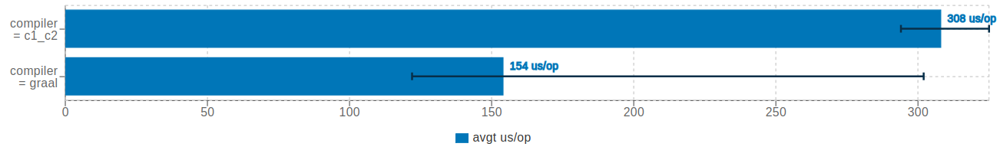](./19_11_CodeCacheBusterBenchmark.png)

<<click on the picture to enlarge or open the full [HTML report](report/jmh_visualizer_jit/index.html) from GitHub >>

#### Conclusions

- Graal JIT reaches around 2x performance speedup.

#### Winner

- Graal JIT

### **MethodArgsBusterBenchmark**

Test how the Compiler could potentially optimize a method that takes a huge number of arguments (64 double arguments).  
Usually, the [register allocation](https://en.wikipedia.org/wiki/Register_allocation) (i.e. the array of register mask bits) should be large enough to cover all the machine registers and all parameters that need to be passed on the stack (stack registers) up to some “interesting” limit. Methods that need more parameters will not be compiled. For example, on Intel, the limit is around 90+ parameters.

```
method(double d00, double d01, ... double d63) {
  return Math.round(d00) +
    Math.round(d01) +
    ... +
    Math.round(d63);
}
```

[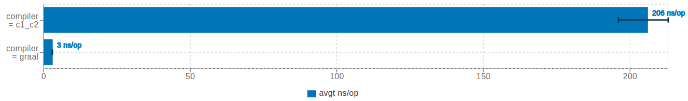](./19_11_MethodArgsBusterBenchmark.png)

<<click on the picture to enlarge or open the full [HTML report](report/jmh_visualizer_jit/index.html) from GitHub >>

#### Conclusions

- Graal JIT reaches around 69x performance speedup.

**Note**: this might be an interesting case to zoom in further (i.e. looking at the generated assembly). At first glance, I suspect Graal JIT is able to to fold it to a constant.

#### Winner

- Graal JIT

### **DeadCodeEliminationBenchmark**

Test how well the Compiler could remove code which does not affect the program results within a loop, optimization which relates to [dead code elimination](https://en.wikipedia.org/wiki/Dead_code_elimination).

```
method() {
  for (int i = 0; i < iterations; i++) {
    // useless method calls
    value1 = call_to_method(param)   // 1st
    value2 = call_to_method(value1); // 2nd
    value3 = call_to_method(value2); // 3rd
    // value1, value2 and value3 vanish here,
    // they are not anymore used within the loop cycle
    // ... do some real operations ...
  }
  // return result
}
```

Where **call\_to\_method**() is:

- either a call to a native method (e.g. Math.tan, Math.atan)
- or a user-defined iterative function (e.g. [Leibniz formula](https://en.wikipedia.org/wiki/Leibniz_formula_for_%CF%80) for PI computation using an infinite series).

[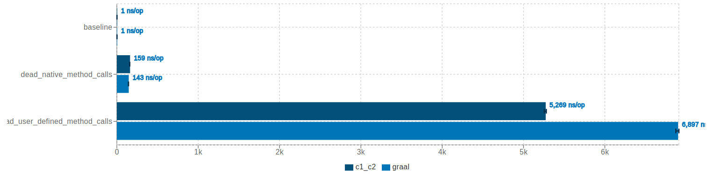](./19_11_DeadCodeEliminationBenchmark.png)

<<click on the picture to enlarge or open the full [HTML report](report/jmh_visualizer_jit/index.html) from GitHub >>

#### Conclusions

- in the case of **dead\_native\_method\_calls** Graal JIT performs slightly better.
- in the case of **dead\_user\_defined\_method\_calls** C1/C2 JIT reaches around 1.3x performance speedup.

#### Winner

- C1/C2 JIT

### **LoopInvariantCodeMotionBenchmark**

Test how Compiler deals with loop invariant code motion, in essence how it is able to move the invariant code before and after a loop. **Hoisting** and **sinking** are terms that Compiler refers to moving operations outside loops:

- **hoisting** a load means to move the load so that it occurs before the loop
- **sinking** a store means to move a store to occur after a loop

Current benchmark computes the sum of recurrent **tan(nx)** based on the formula:

```
tan(ix) = [Math.tan((i - 1) * x) + Math.tan(x)] / [1 - Math.tan((i - 1) * x) * Math.tan(x)]
```

Where:

- i = 1 … n
- x = represents the angle and is constant

```
method() {
  for (int i = 1; i < iterations; i++) {
    v1 = Math.tan((i - 1) * x) + Math.tan(x);
    v2 = 1 - Math.tan((i - 1) * x) * Math.tan(x);
    sum += v1 / v2;
    result = Math.tan(Math.atan(sum));
  }
  return result;
}
```

The current benchmark also exploits the [common subexpression elimination](https://en.wikipedia.org/wiki/Common_subexpression_elimination) since **Math.tan((i – 1) \* x)** is computed twice per loop cycle.

[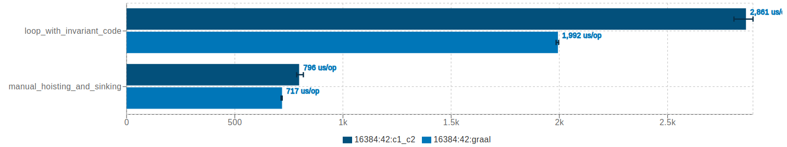](./19_11_LoopInvariantCodeMotionBenchmark.png)

<<click on the picture to enlarge or open the full [HTML report](report/jmh_visualizer_jit/index.html) from GitHub >>

#### Conclusions

- for the explicit **manual\_hoisting\_and\_sinking** case, both compilers perform almost the same (slightly better in favor of Graal JIT).
- for the **loop\_with\_invariant\_code** case, Graal JIT performs better reaching around 1.5x performance speedup. Unfortunately, none of the compilers are even closer to the previous response time, the baseline.

#### Winner

- Graal JIT

### **LoopReductionBenchmark**

Loop reduction (or loop reduce) benchmark tests if a loop could be reduced by the number of additions within that loop. This optimization is based on the induction variable to strength the additions.

```
method(accumulator) {
  for (int i = 0; i < iterations; ++i) {
    accumulator++;
  }
  return accumulator;
}

// is equivalent to:

method(iterations, accumulator) {
  return accumulator + iterations;
}
```

[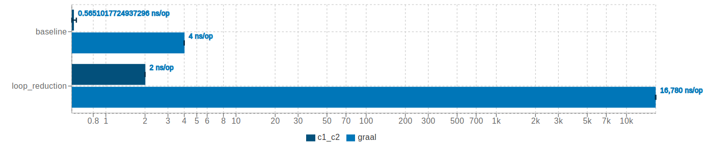](./19_11_LoopReductionBenchmark.png)

<<click on the picture to enlarge or open the full [HTML report](report/jmh_visualizer_jit/index.html) from GitHub >>

#### Conclusions

- for the automatic **loop\_reduction** case, C1/C2 JIT reaches around 8,000x performance speedup which proves the Compiler triggers this kind of optimization.
- for the **baseline** case, it is a bit wired the difference in performance since in both cases the method just returns an addition of the arguments. If I had more time, I would have taken a look over the assembly generated … (quoting Blaise Pascal)

#### Winner

- C1/C2 JIT

### **LoopFusionBenchmark**

[Loop fusion](https://en.wikipedia.org/wiki/Loop_fission_and_fusion) merges adjacent loops into one loop to reduce the loop overhead and improve run-time performance. Benefits of loop fusion:

- reduce the loop overhead
- improve locality by combining loops that reference the same array
- increase the granularity of work done in a loop

```
method() {
  for (i = 0; i < size; i++)
    C[i] = A[i] * 2 + B[i];
  for (i = 0; i < size; i++)
    D[i] = A[i] * 2;
  }

// is equivalent to:

method() {
  for (i = 0; i < size; i++) {
    C[i] = A[i] * 2 + B[i];
    D[i] = A[i] * 2;
  }
}
```

The current benchmark also exploits the [vectorization effect](https://en.wikipedia.org/wiki/Automatic_vectorization), however, there are other dedicated test cases in the current report.

[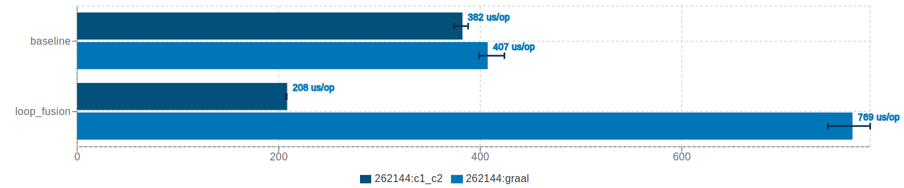](./19_11_LoopFusionBenchmark.png)

<<click on the picture to enlarge or open the full [HTML report](report/jmh_visualizer_jit/index.html) from GitHub >>

#### Conclusions

- in the case of **baseline** both compilers perform almost the same (slightly better in favor of C1/C2 JIT).
- in the case of **loop\_fusion** case C1/C2 JIT performs better, reaching around 3.7x performance speedup.

#### Winner

- C1/C2 JIT

### **LoopControlFlowBenchmark**

Iterates through an array of custom object instances (containing null and not null values) and compute the sum of all not null values using different comparison/filtering strategies.

```
loop_try_catch() {
  for (int i = 0; i < array_length; i++) {
    try {
      sum += array[i].value;
    } catch (NullPointerException ignored) {
    }
  }
}

loop_if_comparison() {
  for (int i = 0; i < array_length; i++) {
    if (array[i] != null)
      sum += array[i].value;
  }
}

loop_continue() {
  for (int i = 0; i < array_length; i++) {
    if (array[i] == null)
      continue;
    sum += array[i].value;
  }
}

stream() {
  Arrays.stream(array)
    .filter(array_element -> array_element != null)
    .map(array_element::getValue)
    .reduce(0, Integer::sum)
}

// the array of elements is initialized as follows:

for (int i = 0; i < array_length; i++) {
  int value = random_value;
  if (value < thresholdLimit) {
    array[i] = null;
  } else {
    array[i] = new ...;
  }
}
```

Where **thresholdLimit** is either:

- always smaller than every array value – no null values in the array
- or partially greater than some arrays values – some of the elements are null

[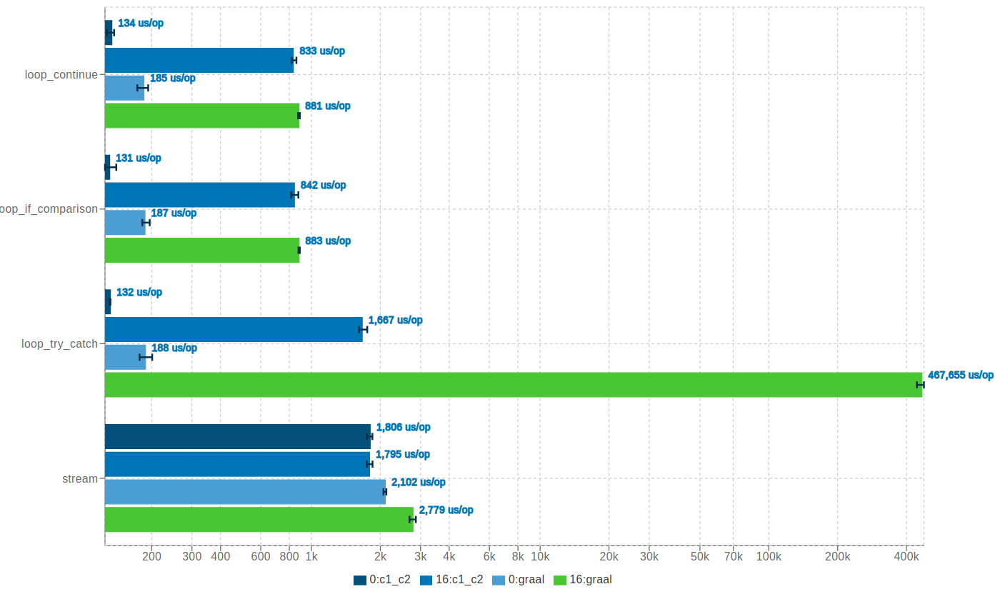](./19_11_LoopControlFlowBenchmark.png)

<<click on the picture to enlarge or open the full [HTML report](report/jmh_visualizer_jit/index.html) from GitHub >>

#### Conclusions

- in all the cases C1/C2 JIT performs better, however, an outstanding difference in favor of C1/C2 JIT is for the **loop\_try\_catch** case (when only some of the elements in the array are null)

#### Winner

- C1/C2 JIT

### **LoopInterchangeBenchmark**

[Loop interchange](https://en.wikipedia.org/wiki/Loop_interchange) is the process of exchanging the order of two iteration variables used by a nested loop. The variable used in the inner loop switches to the outer loop, and vice versa. It is often done to ensure that the elements of a multi-dimensional array are accessed in the order in which they are present in memory, improving locality of reference.

```
method() {
  for i from 0 to N-1
  for j from 0 to N-1
  a[i,j] = i * j
}

// would result in:

method() {
  for j from 0 to N-1
  for i from 0 to N-1
  a[i,j] = i * j
}
```

[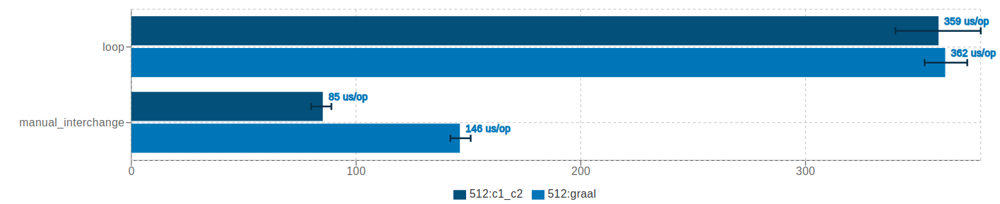](./19_11_LoopInterchangeBenchmark.png)

<<click on the picture to enlarge or open the full [HTML report](report/jmh_visualizer_jit/index.html) from GitHub >>

#### Conclusions

- in the case of **loop** both compilers perform almost the same.
- in the case of **manual\_inetrchange** C1/C2 JIT reaches around 1.7x performance speedup.

#### Winner

- C1/C2 JIT

### **LoopUnswitchBenchmark**

[Loop unswitching](https://en.wikipedia.org/wiki/Loop_unswitching) moves a conditional inside a loop outside of it by duplicating the loop’s body and placing a version of it inside each of the if and else clauses of the conditional. This can increase the size of the code exponentially (e.g. doubling it every time a loop is unswitched). It expects that **loopInvariantPredicate** to run before, in order to hoist it out of the loop and making the unswitching opportunity obvious.

```
for (...) {
  A
    if (loopInvariantPredicate) {
      B
    }
  C
}

// is equivalent to:

if (loopInvariantPredicate) {
  for (...) {
    A
    B
    C
  }
} else {
  for (...) {
    A
    C
  }
}
```

[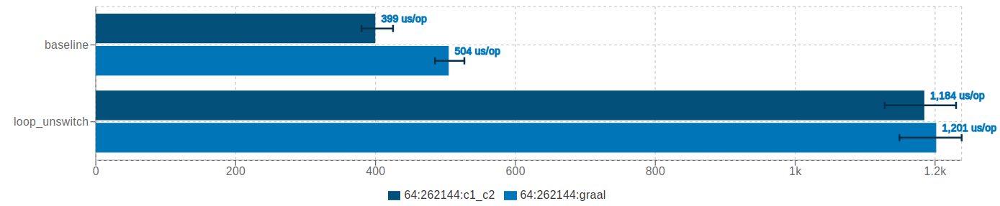](./19_11_LoopUnswitchBenchmark.png)

<<click on the picture to enlarge or open the full [HTML report](report/jmh_visualizer_jit/index.html) from GitHub >>

#### Conclusions

- in the case of **baseline** C1/C2 JIT reaches around 1.3x performance speedup.
- in the case of **loop\_unswitch** both compilers perform almost the same.

#### Winner

- C1/C2 JIT

### **ScalarEvolutionAndLoopOptimizationBenchmark**

Check if the Compiler can recognize the existence of the induction variables and to replace it with simpler computations. This optimization is a special case of strength reduction where all loop iterations are strengthened to a mathematical formula.

```
method() {
  sum = 0;
  for (i = 0; i < size; i++) {
    sum += i;
  }
  return sum;
}

// is equivalent to:

method() {
  return [size * (size - 1)] / 2;
}
```

[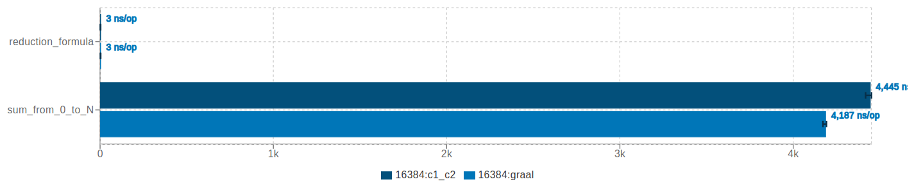](./19_11_ScalarEvolutionAndLoopOptimizationBenchmark.png)

<<click on the picture to enlarge or open the full [HTML report](report/jmh_visualizer_jit/index.html) from GitHub >>

#### Conclusions

- both compilers perform almost the same (slightly better in favor of Graal JIT)

### **CanonicalizeInductionVariableBenchmark**

This transformation analyzes and transforms the induction variables (and computations derived from them) into simpler forms suitable for subsequent analysis and transformation. This optimization is a special case of strength reduction where all loop iterations are strengthened to a mathematical formula.

```
for (i = start; i*i < MAX; ++i) {
}

// is equivalent to:

for (i = 0; i != sqrt(MAX) - start; ++i) {
}
```

[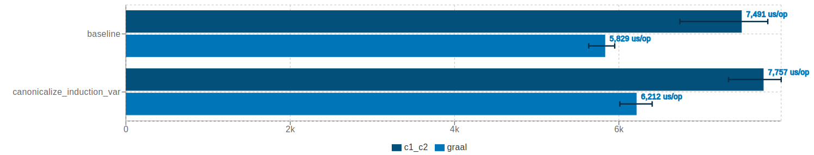](./19_11_CanonicalizeInductionVariableBenchmark.png)

<<click on the picture to enlarge or open the full [HTML report](report/jmh_visualizer_jit/index.html) from GitHub >>

#### Conclusions

- in both cases, Graal JIT performs better, reaching around 1.3x performance speedup.

#### Winner

- Graal JIT

### **StraightenCodeBenchmark**

Tests how well the Compiler straightens code.

```
method(T i) {
  T j;

  if (i < X) {
    // j becomes X, so it should be straightened to j == X case below.
    j = X;
  } else {
    // j becomes Y, so it should be straightened to j == Y case below.
    j = Y;
  }

  if (j == Y) {
    i += Z;
  }

  if (j == X) {
    i += Z;
  }

  return i;
}
```

Where **X**, **Y,**and **Z** are constants.

Benchmark use cases:

- **straighten\_1\_int**: tests how well serial constant integer comparisons are straightened.
- **straighten\_1\_long**: tests how well serial constant long comparisons are straightened.
- **straighten\_2\_int**: tests how well constant integer definitions are straightened.
- **straighten\_2\_long**: tests how well constant long definitions are straightened.
- **straighten\_3\_int**: tests how well variable integer comparisons are straightened.
- **straighten\_3\_long**: tests how well variable long comparisons are straightened.

[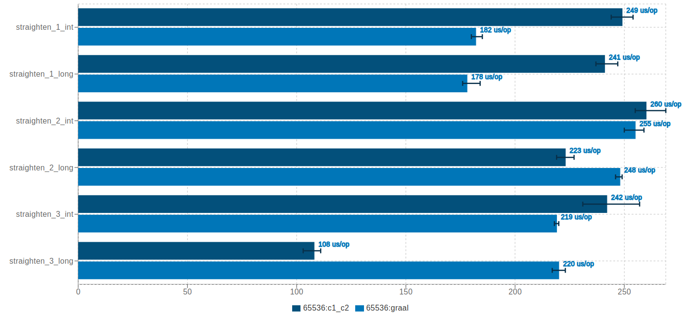](./19_11_StraightenCodeBenchmark.png)

<<click on the picture to enlarge or open the full [HTML report](report/jmh_visualizer_jit/index.html) from GitHub >>

#### Conclusions

- in cases of **straighten\_1\_int** and **straighten\_1\_long** Graal JIT offers better performance, around 1.4x performance speedup.
- in case of **straighten\_2\_int** both compilers perform the same.
- in cases of **straighten\_2\_long** and **straighten\_3\_int** C1/C2 JIT performs slightly better, however, the difference is significantly higher in case of **straighten\_3\_long**, around 2x performance speedup.

### **TailRecursionBenchmark**

A tail-recursive function is a function where the last operation before the function returns is an invocation to the function itself.

Tail-recursive optimization avoids allocating a new stack frame by re-writing the method into a completely iterative fashion.

```
// Fibonacci example
tail_recursive(int n, int a, int b) {
  if (n == 0)
    return a;
  else if (n == 1)
    return b;
  else return tail_recursive(n - 1, b, a + b);
}
```

[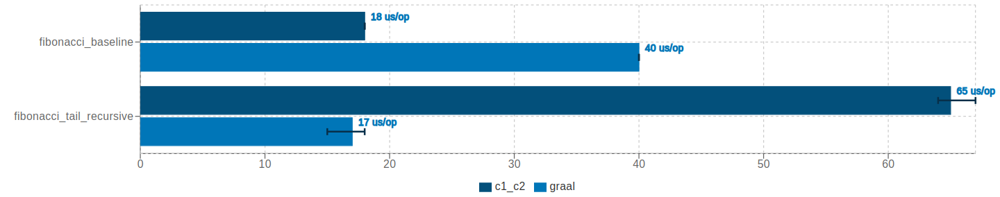](./19_11_TailRecursionBenchmark.png)

<<click on the picture to enlarge or open the full [HTML report](report/jmh_visualizer_jit/index.html) from GitHub >>

#### Conclusions

- in the case of **fibonacci\_tail\_recursive** Graal JIT reaches around 3.8x performance speedup and it is similar to the C1/C2 JIT baseline.
- for the **fibonacci\_****baseline** case, it is a bit wired the difference in performance since in both cases the method contains an iterative loop, I suspect it might be induced by loop optimizations (e.g. unrolling). If I had more time, I would have taken a look over the assembly generated … (quoting Blaise Pascal)

### **NestedLocksBenchmark**

Test how Compiler can effectively merge several nested synchronized blocks that use the same (local and global) lock, thus reducing the locking overhead.

```
global_locks_10x() {
  synchronized (this) {
    // statements 1
    synchronized (this) {
      // statements 2
        synchronized (this) {
          // ...
        }
      }
    }
  }

// is equivalent to:

global_locks_baseline() {
  synchronized (this) {
    // statements 1
    // statements 2
    // ..
  }
}

local_locks_10x() {
  Object lock = new Object();
  synchronized (lock) {
    // statements 1
    synchronized (lock) {
      // statements 2
      synchronized (lock) {
        // ...
      }
    }
  }
}

// is equivalent to:

local_locks_baseline() {
  // statements 1
  // statements 2
  // ..
}
```

[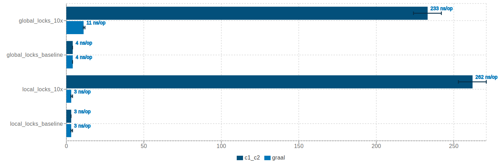](./19_11_NestedLocksBenchmark.png)

<<click on the picture to enlarge or open the full [HTML report](report/jmh_visualizer_jit/index.html) from GitHub >>

#### Conclusions

- except for the **global\_locks\_baseline** and **local\_locks\_baseline**, in all the other cases Graal JIT performs way better.

#### Winner

- Graal JIT

### **StoreAfterStoreBenchmark**

Tests how well the Compiler can remove redundant stores. It’s crucial for the tests to be valid that inlining and allocation are performed.

Benchmark use cases:

- **redundant\_zero\_volatile\_stores**: test the removal of redundant zero volatile stores following an object allocation.
- **redundant\_non\_zero\_volatile\_stores**: test the removal of stores followed by other non-zero stores to the same memory location.

[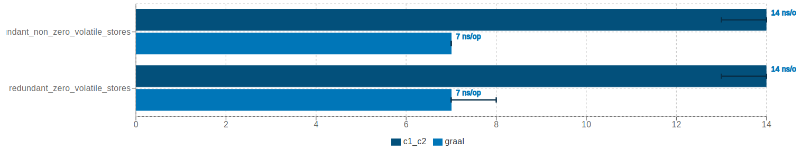](./19_11_StoreAfterStoreBenchmark.png)

<<click on the picture to enlarge or open the full [HTML report](report/jmh_visualizer_jit/index.html) from GitHub >>

#### Conclusions

- Graal JIT reaches around 2x performance speedup.

#### Winner

- Graal JIT

### **PostAllocationStoresBenchmark**

Tests how well the JVM can remove stores after the allocation of objects.

Benchmark use cases:

- **redundant\_null\_or\_zero\_store**: tests the allocation with explicit stores of null/zero for all fields.
- **non\_null\_or\_zero\_store**: tests the allocation with explicit stores of non-null/non-zero for all fields.
- **redundant\_null\_or\_zero\_volatile\_store**: tests the allocation with explicit stores of null/zero for all fields, where all fields are volatile.
- **no\_store**: tests the allocation without any explicit stores for any fields.

[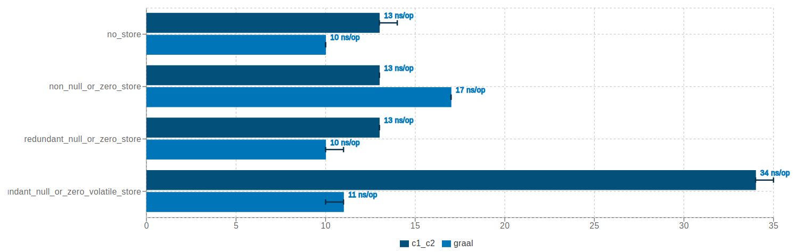](./19_11_PostAllocationStoresBenchmark.png)

<<click on the picture to enlarge or open the full [HTML report](report/jmh_visualizer_jit/index.html) from GitHub >>

#### Conclusions

- in the case of **no\_store**, **non\_null\_or\_zero\_store**, and **redundant\_null\_or\_zero\_store** both compilers perform almost the same (not a significant difference).
- in the case of **redundant\_null\_or\_zero\_volatile\_store** Graal JIT reaches around 3x performance speedup.

#### Winner

- Graal JIT

### **EnumValuesBenchmark**

Tests the cost of calling values() method on an Enum versus caching the values into a list and using the cached version. As a side note, the Enum’s method values() returns a new copy of an array representing its values every time it is called.

```
// declare an ENUM with 31 values
enum ENUM {Value1, Value2, Value3, ... Value31}

values {
  return ENUM.values();
}

cached_enum_set_values {
  return cachedEnumSetValues;
}

// where cachedEnumSetValues = EnumSet.allOf(ENUM.class)
```

[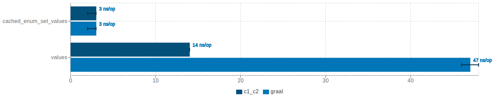](./19_11_EnumValuesBenchmark.png)

<<click on the picture to enlarge or open the full [HTML report](report/jmh_visualizer_jit/index.html) from GitHub >>

#### Conclusions

- in the case of **cached\_enum\_set\_values** both compilers perform almost the same (not a significant difference).
- in the case of **values** C1/C2 JIT reaches around 3.4x performance speedup.

#### Winner

- C1/C2 JIT

### **IdentityHashCodeBenchmark**

Tests the identityHashCode() of the Object() using different algorithms. The algorithm of generating the identity hashCode can be specified using JVM argument **-XX:hashCode**. Possible values:

- **-XX:hashCode=0** – uses global Park-Miller RNG (default until Java 7)
- **-XX:hashCode=1** – this variation has the property of being stable (idempotent) between STW operations
- **-XX:hashCode=2** – constant 1. All objects will have the same hashCode. Just for sensitivity testing
- **-XX:hashCode=3** – incremental counter
- **-XX:hashCode=4** – lowers 32 bits of the object address in the Heap
- **-XX:hashCode=5** – uses Marsaglia’s xor-shift scheme with thread-specific state (default since Java 8)

For more details please check the [OpenJDK sources](http://hg.openjdk.java.net/jdk/jdk13/file/492b644bb9c2/src/hotspot/share/runtime/synchronizer.cpp) (lines 643-673).

```
id_hash_code_X() {
  System.identityHashCode(new Object())
}
```

[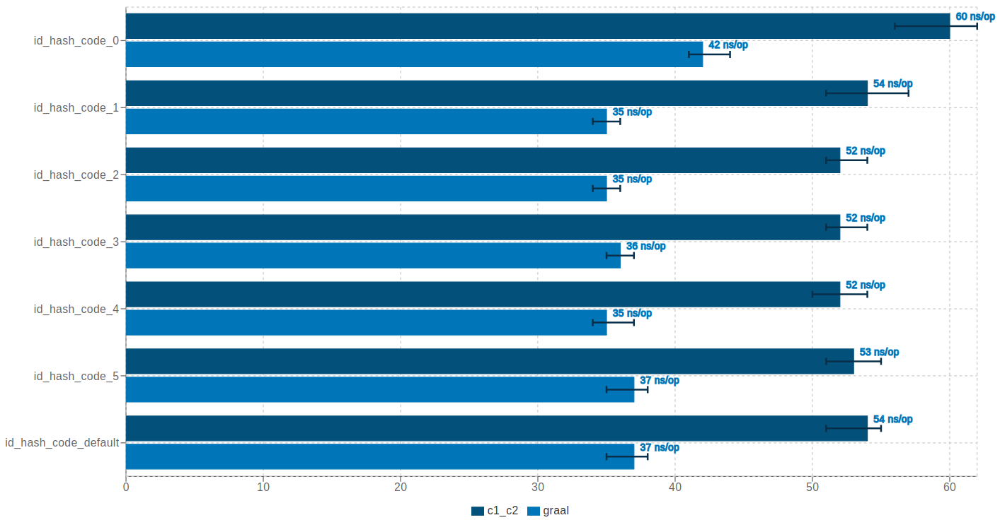](./19_11_IdentityHashCodeBenchmark.png)

<<click on the picture to enlarge or open the full [HTML report](report/jmh_visualizer_jit/index.html) from GitHub >>

#### Conclusions

- in all cases, Graal JIT performs better, reaching around 1.4-1.5x performance speedup.

#### Winner

- Graal JIT

### **NewInstanceBenchmark**

Tests different approaches to create class instances.

```
supplier_new() {
  Supplier<Object> supplier = Object::new;
  return supplier.get();
}

new_operator() {
  return new Object();
}

new_instance() {
  return Object.class.getDeclaredConstructor().newInstance();
}

unsafe_allocateInstance() {
  return UNSAFE.allocateInstance(Object.class);
}
```

[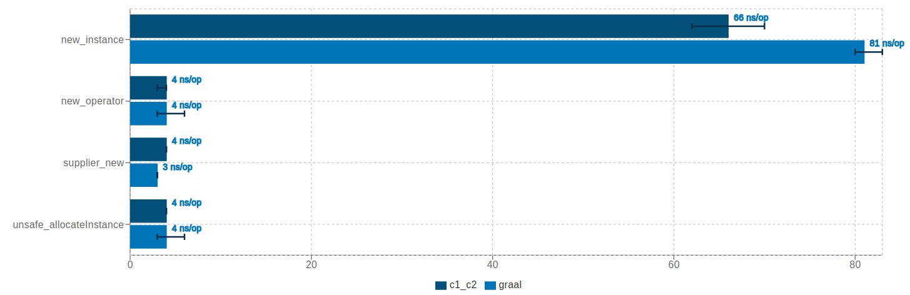](./19_11_NewInstanceBenchmark.png)

<<click on the picture to enlarge or open the full [HTML report](report/jmh_visualizer_jit/index.html) from GitHub >>

#### Conclusions

- in the case of **new\_operator**, **suplier\_new**, and **unsafe\_allocateInstance** both compilers perform the same.
- in the case of **new\_instance** C1/C2 JIT reaches around 1.2x performance speedup.

#### Winner

- C1/C2 JIT

### **PassingConsumerVsExternalForEachIteratorBenchmark**

This test is based on two scenarios:

- Scenario I – a method which returns a List and, outside of the method, iterates through it using a forEach() and a target consumer
- Scenario II – passes the target consumer into a method which internally uses a forEach(), and the consumer received as an argument, to handle the list elements

```
// Scenario I
external_for_each() {
  callAMethodThatReturnsAList().forEach(<consumer>)
}

// Scenario II
passing_consumer() {
  callAMethodThatAcceptsAConsumer(<consumer>)
}

// where <consumer> implements the Consumer::accept
// to handle every list element
```

[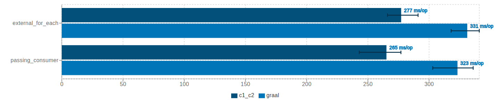](./19_11_PassingConsumerVsExternalForEachIteratorBenchmark.png)

<<click on the picture to enlarge or open the full [HTML report](report/jmh_visualizer_jit/index.html) from GitHub >>

#### Conclusions

- in both cases, C1/C2 JIT performs better, reaching around 1.2x performance speedup.

#### Winner

- C1/C2 JIT

## Final Conclusions

To establish the final “winner”, I sum up each intermediate benchmark result, but only for the evident cases, and the total looks like:

- 15 points for C1/C2 JIT
- 9 points for Graal JIT

Please do not take this report too religiously, it is far away to cover all possible use cases! In addition, some of the benchmarks might have flaws, others might need additional effort to deep-dive and try to understand the real cause behind the figures (which is out of scope). Nevertheless, I think it gives you a broader understanding and proves that neither Compiler is perfect. There are pros and cons on each side, each has its strengths and weaknesses.

On top of that, it is very difficult to predict which Compiler performs better in a real-world application. My advice is to try it on your own. Micro-benchmarks are nice, but what it really matters is the difference in performance on production code. However, if you want some general application guidelines, please check my presentation “**A race of two compilers: Graal JIT vs. C2 JIT. Which one offers better runtime performance?**” . It also includes the Garbage Collectors compatibility in OpenJDK (i.e. Graal JIT cannot be enabled with every Garbage Collector).

I hope you have enjoyed reading it, despite the length. If you find this useful or interesting, I would be very glad to get your feedback (in terms of missing use cases, unclear explanations, etc.) or, if you want to contribute with different benchmark patterns please do not hesitate to [get in touch](https://ionutbalosin.com/contact/).
