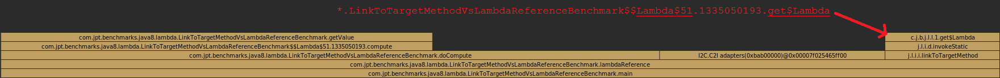
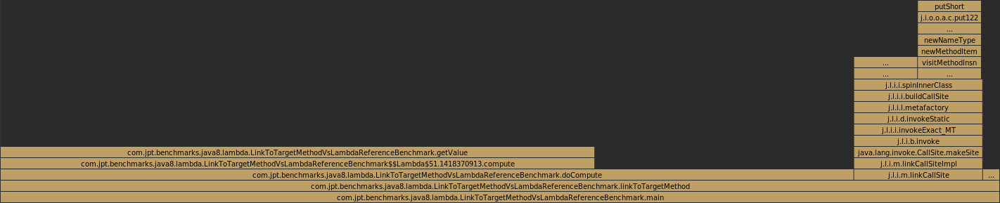

# Passing this::method reference within a loop affects performance

## Content

- [Motivation](#motivation)
- [The problem](#the-problem)
- [How to avoid this issue?](#how-to-avoid-this-issue)
- [Microbenchmark](#microbenchmark)
- [What really happens?](#what-really-happens)
- [Final Conclusions](#final-conclusions)

## Motivation

The problem I would like address affects the performance in case **this::method** reference is passed to another method (especially within a long running loop), hence it is important to be aware and avoid this situation.

## The problem

This arises when a lambda or a method reference which captures **this** reference (e.g. **this::method**) is passed to another method (e.g. doCompute() method in my example) within a loop (especially a long-running loop). In this situation, there seems to be a considerable performance penalty, also spotted by benchmark tests.  
This problematic pattern could be summarized as follows:

```
method() {
  loop() {
    result = doCompute(this::method); // the trap!
    // use the result ...  
  }
}
```

What happens is that at run-time capturing **this** reference causes the lambda or the method reference to allocate an object every time it is passed the other method (i.e. doCompute() method), even though in such case this might not happen anyway (since lambda itself does not modify any state).

## How to avoid this issue?

**One solution** is to use a variable for the method reference outside of the loop and to pass it to the method within the loop, as follows:

```
method() {
  methodReference = this::method; // local variable
    loop() {
    result = doCompute(methodReference);
    // use the result ...
  }
}
```

However, please notice this might not work in all cases, since during runtime also the JIT Compiler tries to optimize the loops by hoisting the loop iteration!

**The second option** is to move the method reference into a field, outside of the method, which belongs to the class:

```
methodReference = this::method; // class field
  // ...
  method() {
  loop() {
    result = doCompute(methodReference);
    // use the result ...
  }
}
```

Another **third possible solution** might be to remove the method reference, to have a class which implements the functional interface and to passes this as an argument (and of course other variations, but I will not focus on them in this article).

## Microbenchmark

I have created a short benchmark corresponding to the first option (i.e. using a variable for the method reference) to test the performance for different loop sizes.

```java
@BenchmarkMode(Mode.AverageTime)
@OutputTimeUnit(TimeUnit.MICROSECONDS)
@Warmup(iterations = 5, time = 5, timeUnit = TimeUnit.MICROSECONDS)
@Measurement(iterations = 5, time = 5, timeUnit = TimeUnit.MICROSECONDS)
@Fork(value = 3, warmups = 1, jvmArgsAppend = { })
@State(Scope.Benchmark)
public class LinkToTargetMethodVsLambdaReferenceBenchmark {

  @Param({"1000", "10000", "100000", "1000000", "10000000"})
  int size;

  @Param({ "1" })
  int factor;

  int[] array;
  int shiftResult;

  public static void main(String[] args) throws RunnerException {
    Options opt =
      new OptionsBuilder()
       .include(LinkToTargetMethodVsLambdaReferenceBenchmark.class.getSimpleName())
        .build();
    new Runner(opt).run();
  }

  @Setup
  public void setupList(){
    array = new int[size];
    for (int i = 0; i < size; i ++) {
      array[i] = i;
    }
  }

  @Benchmark
  public long linkToTargetMethod() {
    // Create a method reference variable outside of the loop
    ComputeFunctionalInterface fInterface = this::getValue;
    long result = 0;
    for (int i = 0; i < size; i++ ) {
      shiftResult = array[i] >> factor;
      result += doCompute(i, fInterface);
    }
    return result;
  }

  @Benchmark
  public long lambdaReference() {
    long result = 0;
    for (int i = 0; i < size; i++ ) {
      shiftResult = array[i] >> factor;
      // Pass the reference directly to the method within the loop
      result += doCompute(i, this::getValue);
    }
    return result;
  }

  public int doCompute(int i, ComputeFunctionalInterface fInterface) {
    return i * fInterface.compute(i);
  }

  private int getValue(int value) {
    // Irrelevant method computation ...
    // Capturing the state is all that matters!
    return (shiftResult % 3 == 0 || shiftResult % 5 == 0) ? value : 1;
  }

}

@FunctionalInterface
public interface ComputeFunctionalInterface {
  int compute(int i);
}
```

Test output:

```
Benchmark              (size) Mode Cnt Score Error Units

lambdaReference         1,000 avgt 15 2.584 0.047 us/op
lambdaReference        10,000 avgt 15 24.885 1.535 us/op
lambdaReference       100,000 avgt 15 237.756 3.130 us/op
lambdaReference     1,000,000 avgt 15 3,748.218 36.642 us/op
lambdaReference    10,000,000 avgt 15 37,597.158 477.473 us/op

linkToTargetMethod       1000 avgt 15 2.569 0.064 us/op
linkToTargetMethod     10,000 avgt 15 24.254 0.456 us/op
linkToTargetMethod    100,000 avgt 15 239.485 2.551 us/op
linkToTargetMethod  1,000,000 avgt 15 2,946.587 222.539 us/op
linkToTargetMethod 10,000,000 avgt 15 28,890.146 313.623 us/op
```

*Tests triggered using JDK 11.0.1 (latest JDK release at the moment) on my machine (CPU: Intel i7-6600U Skylake; MEMORY: 16GB DDR4 2133 MHz; OS: Windows 7 Enterprise)*

##### Conclusions after this test scenario

1. **lambdaReference** seems to be significantly slower than **linkToTargetMethod** for bigger loop sizes (e.g. 1M and 10M iterations)
2. the most significant difference between these two starts for more than 1M elements, when **linkToTargetMethod** performs, on average, around 30% better

## What really happens?

Probably an easy way to profile these methods is by using [IDEA v2018.3 Ultimate edition](https://blog.jetbrains.com/idea/2018/09/intellij-idea-2018-3-eap-git-submodules-jvm-profiler-macos-and-linux-and-more) which comes with [Async Profiler](https://github.com/jvm-profiling-tools/async-profiler) integrated and to have a look over generated flame charts.

##### **lambdaReference** test case:

[](./lambdaReference.png)

As pointed out, the issue here is the call to **Lambda$51**.**get$Lambda** which generates a new instance every time. Below is the VM anonymous class generated during startup which reveals this:

```
final class LinkToTargetMethodVsLambdaReferenceBenchmark$$Lambda$51 implements ComputeFunctionalInterface {
  private final LinkToTargetMethodVsLambdaReferenceBenchmark arg$1;

  // Private constructor
  private LinkToTargetMethodVsLambdaReferenceBenchmark$$Lambda$51(LinkToTargetMethodVsLambdaReferenceBenchmark var1) {
    this.arg$1 = var1;
  }

  // Generates a new instance for every call !
  private static ComputeFunctionalInterface get$Lambda(LinkToTargetMethodVsLambdaReferenceBenchmark var0) {
    return new LinkToTargetMethodVsLambdaReferenceBenchmark$$Lambda$51(var0);
  }

  // Just dispatches the call back to LinkToTargetMethodVsLambdaReferenceBenchmark
  @Hidden
  public int compute(int var1) {
    return this.arg$1.getValue(var1);
  }
}
```

*To understand how lambda works under the hood and how to get the VM anonymous classes during startup please check my from a previous conference.*

##### **linkToTargetMethod** test case:

[](./linkToTargetMethod.png)

As opposed to the previous flame graphs, in this case, there is no captured **Lambda$51.get$Lambda** call by the graph, hence there substantially fewer heap allocations.

## Final Conclusions

- avoid passing **this::method** to a method within a loop since it really affects performance
- to overcome this issue, replace **this::method** by (one of below options):
  - a variable outside of the loop (inside the method)
  - a field variable belonging to the class (outside of the method)
  - create a class which implements the functional interface and to pass **this** as an argument
